## 源状态(FROM_STATE) <!-- {docsify-ignore-all} -->

   

### 默认规则 :id=Default

```plantuml
@startuml
hide empty description
<style>
root {
  HyperlinkColor #42b983
}
</style>

state "start" as start  <<start>>
state "end" as end <<end>>
state "默认字符串长度" as 39e0e9a256f2f993b6096bbda983da9f [[$./From_state#a39e0e9a256f2f993b6096bbda983da9f {"默认字符串长度"}]]


start --> 39e0e9a256f2f993b6096bbda983da9f 
39e0e9a256f2f993b6096bbda983da9f --> end 


@enduml
```

#### 条件说明

##### 默认字符串长度 :id=a39e0e9a256f2f993b6096bbda983da9f

*关键条件*

`FROM_STATE(源状态)` 属性长度在区间 `(0 , 100]` 内

> [!ATTENTION|label:规则信息|icon:fa fa-warning]
> 内容长度必须小于等于[100]

