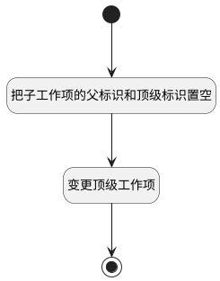

## 子工作项取消关联 <!-- {docsify-ignore-all} -->

   

### 处理过程

### 处理步骤说明

#### 开始 :id=Begin [开始]

*- N/A*
#### 把子工作项的父标识和顶级标识置空 :id=PREPAREPARAM1 [准备参数]

1. 将`空值（NULL）` 设置给  `Default(传入变量).PID(父标识)`
2. 将`空值（NULL）` 设置给  `Default(传入变量).TOP_ID(顶级工作项标识)`

#### 变更顶级工作项 :id=DELOGIC1 [实体逻辑]

调用实体 [工作项(WORK_ITEM)](module/ProjMgmt/Work_item.md) 处理逻辑 [变更顶级工作项]((module/ProjMgmt/Work_item/logic/change_top.md)) ，行为参数为`Default(传入变量)`

#### 结束 :id=END1 [结束]

*- N/A*

### 实体逻辑参数

|    中文名   |    代码名    |  数据类型    |  实体   |备注 |
| --------| --------| -------- | -------- | --------   |
|传入变量(<i class="fa fa-check"/></i>)|Default|数据对象|[工作项(WORK_ITEM)](module/ProjMgmt/Work_item.md)||
