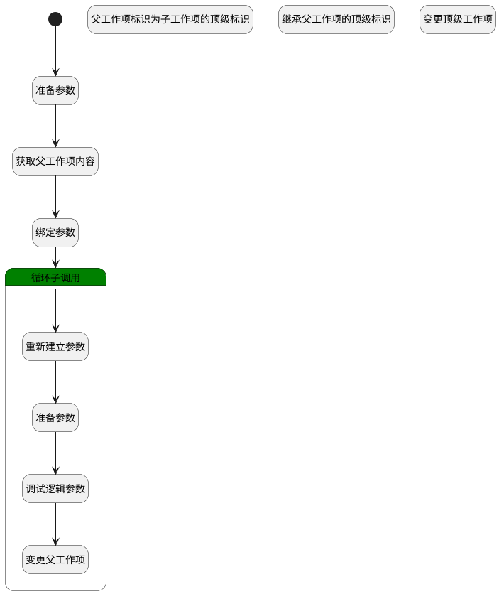

## 选择子工作项 <!-- {docsify-ignore-all} -->

   

### 处理过程




### 处理步骤说明

#### 开始 :id=Begin<sup class="footnote-symbol"> <font color=gray size=1>[开始]</font></sup>


*- N/A*
#### 准备参数 :id=PREPAREPARAM2<sup class="footnote-symbol"> <font color=gray size=1>[准备参数]</font></sup>


1. 将`Default(传入变量).PID(父标识)` 设置给  `parent_work_item(父工作项).ID(标识)`

#### 获取父工作项内容 :id=DEACTION2<sup class="footnote-symbol"> <font color=gray size=1>[实体行为]</font></sup>


调用实体 [工作项(WORK_ITEM)](module/ProjMgmt/Work_item.md) 行为 [Get](module/ProjMgmt/Work_item#行为) ，行为参数为`parent_work_item(父工作项)`

将执行结果返回给参数`parent_work_item(父工作项)`

#### 绑定参数 :id=BINDPARAM1<sup class="footnote-symbol"> <font color=gray size=1>[绑定参数]</font></sup>


绑定参数`Default(传入变量)` 到 `srfactionparam(选中子工作项列表)`
#### 循环子调用 :id=LOOPSUBCALL1<sup class="footnote-symbol"> <font color=gray size=1>[循环子调用]</font></sup>


循环参数`srfactionparam(选中子工作项列表)`，子循环参数使用`for_temp_obj(循环临时变量)`
#### 重新建立参数 :id=RENEWPARAM1<sup class="footnote-symbol"> <font color=gray size=1>[重新建立参数]</font></sup>


重建参数```update_obj(更新对象)```
#### 准备参数 :id=PREPAREPARAM1<sup class="footnote-symbol"> <font color=gray size=1>[准备参数]</font></sup>


1. 将`parent_work_item(父工作项).ID(标识)` 设置给  `update_obj(更新对象).PID(父标识)`
2. 将`for_temp_obj(循环临时变量).owner_id` 设置给  `update_obj(更新对象).ID(标识)`

#### 调试逻辑参数 :id=DEBUGPARAM1<sup class="footnote-symbol"> <font color=gray size=1>[调试逻辑参数]</font></sup>


> [!NOTE|label:调试信息|icon:fa fa-bug]
> 调试输出参数`update_obj(更新对象)`的详细信息


#### 变更父工作项 :id=DEACTION1<sup class="footnote-symbol"> <font color=gray size=1>[实体行为]</font></sup>


调用实体 [工作项(WORK_ITEM)](module/ProjMgmt/Work_item.md) 行为 [Update](module/ProjMgmt/Work_item#行为) ，行为参数为`update_obj(更新对象)`

将执行结果返回给参数`update_obj(更新对象)`

#### 父工作项标识为子工作项的顶级标识 :id=PREPAREPARAM3<sup class="footnote-symbol"> <font color=gray size=1>[准备参数]</font></sup>


1. 将`parent_work_item(父工作项).ID(标识)` 设置给  `for_temp_obj(循环临时变量).TOP_ID(顶级工作项标识)`

#### 继承父工作项的顶级标识 :id=PREPAREPARAM4<sup class="footnote-symbol"> <font color=gray size=1>[准备参数]</font></sup>


1. 将`parent_work_item(父工作项).TOP_ID(顶级工作项标识)` 设置给  `for_temp_obj(循环临时变量).TOP_ID(顶级工作项标识)`

#### 变更顶级工作项 :id=DELOGIC1<sup class="footnote-symbol"> <font color=gray size=1>[实体逻辑]</font></sup>


调用实体 [工作项(WORK_ITEM)](module/ProjMgmt/Work_item.md) 处理逻辑 [变更顶级工作项]((module/ProjMgmt/Work_item/logic/change_top.md)) ，行为参数为`for_temp_obj(循环临时变量)`


### 实体逻辑参数

|    中文名   |    代码名    |  数据类型    |  实体   |备注 |
| --------| --------| -------- | -------- | --------   |
|传入变量(<i class="fa fa-check"/></i>)|Default|数据对象|[工作项(WORK_ITEM)](module/ProjMgmt/Work_item.md)||
|循环临时变量|for_temp_obj|数据对象|[工作项(WORK_ITEM)](module/ProjMgmt/Work_item.md)||
|父工作项|parent_work_item|数据对象|[工作项(WORK_ITEM)](module/ProjMgmt/Work_item.md)||
|选中子工作项列表|srfactionparam|数据对象列表|[工作项(WORK_ITEM)](module/ProjMgmt/Work_item.md)||
|更新对象|update_obj|数据对象|[工作项(WORK_ITEM)](module/ProjMgmt/Work_item.md)||
