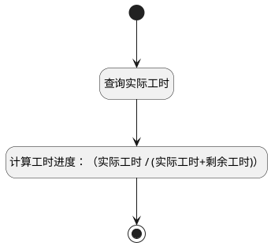

## 获取工时进度 <!-- {docsify-ignore-all} -->

   get行为附加逻辑

### 处理过程




### 处理步骤说明

#### 开始 :id=Begin<sup class="footnote-symbol"> <font color=gray size=1>[开始]</font></sup>


*- N/A*
#### 查询实际工时 :id=RAWSQLCALL1<sup class="footnote-symbol"> <font color=gray size=1>[直接SQL调用]</font></sup>


<p class="panel-title"><b>执行sql语句</b></p>

```sql
select sum(DURATION) as `ACTUAL_WORKLOAD` from workload where OWNER_TYPE = 'actual_workload' and PRINCIPAL_TYPE = 'WORK_ITEM' and PRINCIPAL_ID = ?
```

<p class="panel-title"><b>执行sql参数</b></p>

1. `Default(传入变量).ID(标识)`

重置参数`Default(传入变量)`，并将执行sql结果赋值给参数`Default(传入变量)`

#### 计算工时进度：（实际工时 / (实际工时+剩余工时)） :id=RAWSFCODE1<sup class="footnote-symbol"> <font color=gray size=1>[直接后台代码]</font></sup>


<p class="panel-title"><b>执行代码[JavaScript]</b></p>

```groovy
var defaultObj = logic.getParam("default");
sys.info("分子", defaultObj.get("actual_workload"));
var estimated_workload = defaultObj.get("estimated_workload") == null ? 0 : parseFloat(defaultObj.get("estimated_workload"));
var actual_workload= defaultObj.get("actual_workload") == null ? 0 : parseFloat(defaultObj.get("actual_workload"));
var remaining_workload = (estimated_workload - actual_workload) > 0 ? (estimated_workload - actual_workload) : 0;
if((actual_workload + remaining_workload) > 0 && actual_workload > 0){
    var workload_schedule = (actual_workload / (actual_workload + remaining_workload)) * 100;
    defaultObj.set("workload_schedule", workload_schedule.toFixed(1));
    if(workload_schedule > 100){
        defaultObj.set("workload_schedule", 100);
    }
}

if(defaultObj.get("actual_workload") != null){
    sys.info("分母", actual_workload);
    defaultObj.set("actual_workload", Number(actual_workload).toFixed(1));
    if(defaultObj.get("estimated_workload") != null){
        defaultObj.set("remaining_workload", Number(remaining_workload).toFixed(1));
    }
} else {
    defaultObj.set("actual_workload", null);
    defaultObj.set("remaining_workload", defaultObj.get("estimated_workload"));
}
```

#### 结束 :id=END1<sup class="footnote-symbol"> <font color=gray size=1>[结束]</font></sup>


返回 `Default(传入变量)`


### 实体逻辑参数

|    中文名   |    代码名    |  数据类型    |  实体   |备注 |
| --------| --------| -------- | -------- | --------   |
|传入变量(<i class="fa fa-check"/></i>)|Default|数据对象|[工作项(WORK_ITEM)](module/ProjMgmt/Work_item.md)||
