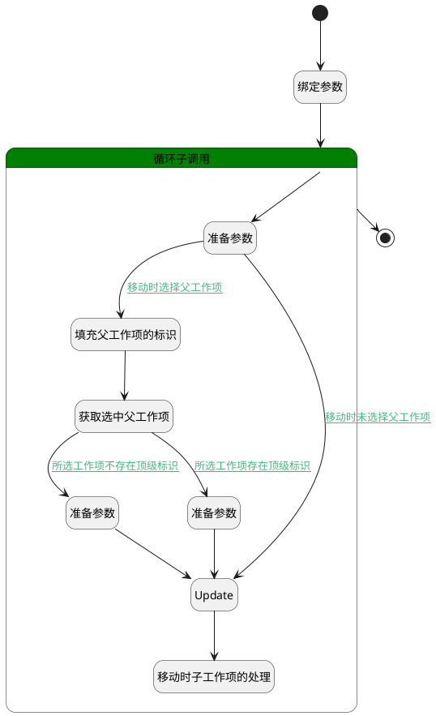

## 移动工作项 <!-- {docsify-ignore-all} -->

   

### 处理过程

### 处理步骤说明

#### 开始 :id=Begin [开始]

*- N/A*
#### 填充父工作项的标识 :id=PREPAREPARAM5 [准备参数]

1. 将`for_temp_obj(循环临时变量).PID(父标识)` 设置给  `parent_work_item(父工作项).ID(标识)`

#### 获取选中父工作项 :id=DEACTION2 [实体行为]

调用实体 [工作项(WORK_ITEM)](module/ProjMgmt/Work_item.md) 行为 [Get](module/ProjMgmt/Work_item#行为) ，行为参数为`parent_work_item(父工作项)`

将执行结果返回给参数`parent_work_item(父工作项)`

#### 绑定参数 :id=BINDPARAM1 [绑定参数]

绑定参数`Default(传入变量)` 到 `srfactionparam(选中项目)`
#### 循环子调用 :id=LOOPSUBCALL1 [循环子调用]

循环参数`srfactionparam(选中项目)`，子循环参数使用`for_temp_obj(循环临时变量)`
#### 准备参数 :id=PREPAREPARAM3 [准备参数]

1. 将`for_temp_obj(循环临时变量).target_project_id` 设置给  `Default(传入变量).PROJECT_ID(项目标识)`
2. 将` ==> Default[IDENTIFIER]` 设置给  `Default(传入变量).IDENTIFIER(编号)`
3. 将`空值（NULL）` 设置给  `Default(传入变量).BOARD_ID(看板标识)`
4. 将`空值（NULL）` 设置给  `Default(传入变量).ENTRY_ID(看板栏标识)`
5. 将`空值（NULL）` 设置给  `Default(传入变量).SWIMLANE_ID(泳道标识)`
6. 将`空值（NULL）` 设置给  `Default(传入变量).TOP_ID(顶级工作项标识)`
7. 将`空值（NULL）` 设置给  `Default(传入变量).PID(父标识)`

#### 准备参数 :id=PREPAREPARAM4 [准备参数]

1. 将`parent_work_item(父工作项).TOP_ID(顶级工作项标识)` 设置给  `Default(传入变量).TOP_ID(顶级工作项标识)`
2. 将`parent_work_item(父工作项).ID(标识)` 设置给  `Default(传入变量).PID(父标识)`

#### 准备参数 :id=PREPAREPARAM2 [准备参数]

1. 将`parent_work_item(父工作项).ID(标识)` 设置给  `Default(传入变量).PID(父标识)`
2. 将`parent_work_item(父工作项).ID(标识)` 设置给  `Default(传入变量).TOP_ID(顶级工作项标识)`

#### Update :id=DEACTION1 [实体行为]

调用实体 [工作项(WORK_ITEM)](module/ProjMgmt/Work_item.md) 行为 [Update](module/ProjMgmt/Work_item#行为) ，行为参数为`Default(传入变量)`

将执行结果返回给参数`Default(传入变量)`

#### 结束 :id=END1 [结束]

返回 `Default(传入变量)`

#### 移动时子工作项的处理 :id=DELOGIC1 [实体逻辑]

调用实体 [工作项(WORK_ITEM)](module/ProjMgmt/Work_item.md) 处理逻辑 [移动时子工作项的处理]((module/ProjMgmt/Work_item/logic/move_child_work_item.md)) ，行为参数为`Default(传入变量)`

### 连接条件说明
#### 移动时未选择父工作项 :id=PREPAREPARAM3-DEACTION1

`for_temp_obj(循环临时变量).PID(父标识)` ISNULL
#### 移动时选择父工作项 :id=PREPAREPARAM3-PREPAREPARAM5

`for_temp_obj(循环临时变量).PID(父标识)` ISNOTNULL
#### 所选工作项不存在顶级标识 :id=DEACTION2-PREPAREPARAM2

`parent_work_item(父工作项).TOP_ID(顶级工作项标识)` ISNULL
#### 所选工作项存在顶级标识 :id=DEACTION2-PREPAREPARAM4

`parent_work_item(父工作项).TOP_ID(顶级工作项标识)` ISNOTNULL

### 实体逻辑参数

|    中文名   |    代码名    |  数据类型    |  实体   |备注 |
| --------| --------| -------- | -------- | --------   |
|传入变量(<i class="fa fa-check"/></i>)|Default|数据对象|[工作项(WORK_ITEM)](module/ProjMgmt/Work_item.md)||
|循环临时变量|for_temp_obj|数据对象|[工作项(WORK_ITEM)](module/ProjMgmt/Work_item.md)||
|父工作项|parent_work_item|数据对象|[工作项(WORK_ITEM)](module/ProjMgmt/Work_item.md)||
|选中项目|srfactionparam|数据对象列表|[工作项(WORK_ITEM)](module/ProjMgmt/Work_item.md)||
