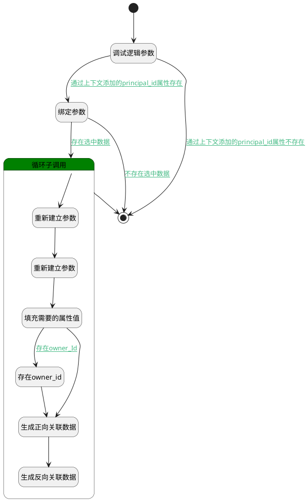

## 其他实体关联工作项 <!-- {docsify-ignore-all} -->

   

### 处理过程




### 处理步骤说明

#### 开始 :id=Begin<sup class="footnote-symbol"> <font color=gray size=1>[开始]</font></sup>


*- N/A*
#### 调试逻辑参数 :id=DEBUGPARAM1<sup class="footnote-symbol"> <font color=gray size=1>[调试逻辑参数]</font></sup>


> [!NOTE|label:调试信息|icon:fa fa-bug]
> 调试输出参数`Default(传入变量)`的详细信息


#### 绑定参数 :id=BINDPARAM1<sup class="footnote-symbol"> <font color=gray size=1>[绑定参数]</font></sup>


绑定参数`Default(传入变量)` 到 `selectdata(关联列表)`
#### 循环子调用 :id=LOOPSUBCALL1<sup class="footnote-symbol"> <font color=gray size=1>[循环子调用]</font></sup>


循环参数`selectdata(关联列表)`，子循环参数使用`for_temp_obj(循环临时变量)`
#### 重新建立参数 :id=RENEWPARAM1<sup class="footnote-symbol"> <font color=gray size=1>[重新建立参数]</font></sup>


重建参数```relationobj(关系对象)```
#### 重新建立参数 :id=RENEWPARAM2<sup class="footnote-symbol"> <font color=gray size=1>[重新建立参数]</font></sup>


重建参数```relationobj2(反向关系对象)```
#### 填充需要的属性值 :id=PREPAREPARAM1<sup class="footnote-symbol"> <font color=gray size=1>[准备参数]</font></sup>


1. 将`Default(传入变量).principal_id` 设置给  `relationobj(关系对象).PRINCIPAL_ID(关联主体标识)`
2. 将`for_temp_obj(循环临时变量).ID(标识)` 设置给  `relationobj2(反向关系对象).PRINCIPAL_ID(关联主体标识)`
3. 将`Default(传入变量).principal_id` 设置给  `relationobj2(反向关系对象).TARGET_ID(关联目标标识)`
4. 将`Default(传入变量).target_type` 设置给  `relationobj2(反向关系对象).PRINCIPAL_TYPE(关联主体类型)`
5. 将`Default(传入变量).principal_type` 设置给  `relationobj2(反向关系对象).TARGET_TYPE(关联目标类型)`
6. 将`Default(传入变量).principal_type` 设置给  `relationobj(关系对象).PRINCIPAL_TYPE(关联主体类型)`
7. 将`Default(传入变量).target_type` 设置给  `relationobj(关系对象).TARGET_TYPE(关联目标类型)`
8. 将`for_temp_obj(循环临时变量).ID(标识)` 设置给  `relationobj(关系对象).TARGET_ID(关联目标标识)`

#### 存在owner_id :id=PREPAREPARAM2<sup class="footnote-symbol"> <font color=gray size=1>[准备参数]</font></sup>


1. 将`for_temp_obj(循环临时变量).owner_id` 设置给  `relationobj(关系对象).TARGET_ID(关联目标标识)`
2. 将`for_temp_obj(循环临时变量).owner_id` 设置给  `relationobj2(反向关系对象).PRINCIPAL_ID(关联主体标识)`

#### 结束 :id=END1<sup class="footnote-symbol"> <font color=gray size=1>[结束]</font></sup>


*- N/A*

#### 生成正向关联数据 :id=DEACTION1<sup class="footnote-symbol"> <font color=gray size=1>[实体行为]</font></sup>


调用实体 [关联(RELATION)](module/Base/Relation.md) 行为 [Save](module/Base/Relation#行为) ，行为参数为`relationobj(关系对象)`

#### 生成反向关联数据 :id=DEACTION2<sup class="footnote-symbol"> <font color=gray size=1>[实体行为]</font></sup>


调用实体 [关联(RELATION)](module/Base/Relation.md) 行为 [Save](module/Base/Relation#行为) ，行为参数为`relationobj2(反向关系对象)`


### 连接条件说明
#### 通过上下文添加的principal_id属性存在 :id=DEBUGPARAM1-BINDPARAM1

`Default(传入变量).principal_id` ISNOTNULL
#### 存在选中数据 :id=BINDPARAM1-LOOPSUBCALL1

`selectdata(关联列表).size` GT `0`
#### 存在owner_Id :id=PREPAREPARAM1-PREPAREPARAM2

`for_temp_obj(循环临时变量).owner_id` ISNOTNULL
#### 不存在选中数据 :id=BINDPARAM1-END1

`selectdata(关联列表).size` EQ `0`
#### 通过上下文添加的principal_id属性不存在 :id=DEBUGPARAM1-END1

`Default(传入变量).principal_id` ISNULL


### 实体逻辑参数

|    中文名   |    代码名    |  数据类型    |  实体   |备注 |
| --------| --------| -------- | -------- | --------   |
|传入变量(<i class="fa fa-check"/></i>)|Default|数据对象|[工作项(WORK_ITEM)](module/ProjMgmt/Work_item.md)||
|循环临时变量|for_temp_obj|数据对象|[工作项(WORK_ITEM)](module/ProjMgmt/Work_item.md)||
|关系对象|relationobj|数据对象|[关联(RELATION)](module/Base/Relation.md)||
|反向关系对象|relationobj2|数据对象|[关联(RELATION)](module/Base/Relation.md)||
|关联列表|selectdata|数据对象列表|[工作项(WORK_ITEM)](module/ProjMgmt/Work_item.md)||
