## 计算表格列行为状态 <!-- {docsify-ignore-all} -->

   用于动态控制归档和激活行为的禁用状态

### 处理过程

```plantuml
@startuml
hide footbox
<style>
root {
  HyperlinkColor #42b983
}
</style>

hide empty description
state "开始" as Begin <<start>> [[$./calc_column_action_state#begin {开始}]]
state "注入脚本代码" as RAWJSCODE1  [[$./calc_column_action_state#rawjscode1 {注入脚本代码}]]
state "结束" as END1 <<end>> [[$./calc_column_action_state#end1 {结束}]]


Begin --> RAWJSCODE1
RAWJSCODE1 --> END1


@enduml
```




### 处理步骤说明

#### 开始 :id=Begin


#### 注入脚本代码 :id=RAWJSCODE1


<p class="panel-title"><b>执行代码</b></p>

```javascript
setTimeout(() => {
	const rows = uiLogic.grid.state.rows;
	if (rows && rows.length > 0) {
		rows.forEach(row => {
			const titleColumn = row.uiActionGroupStates.title;
			const is_archived = row.data.is_archived;
			if (titleColumn && Object.values(titleColumn).length > 0) {
				Object.values(titleColumn).forEach(action => {
					// 归档
					if (action.uiActionId === 'archive@work_item') {
						action.disabled = is_archived !== 0;
					} else if (action.uiActionId === 'activate@work_item') {
						// 激活
						action.disabled = is_archived === 0;
					}
				})
			}
		})
	}
}, 1000);
```

#### 结束 :id=END1


### 实体逻辑参数

|    中文名   |    代码名    |  数据类型      |备注 |
| --------| --------| --------  | --------   |
|表格|Grid|当前部件对象||
|传入变量(<i class="fa fa-check"/></i>)|Default|数据对象||
