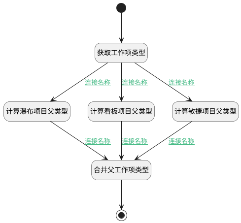

## 计算父工作项类型 <!-- {docsify-ignore-all} -->

   

### 处理过程




### 处理步骤说明

#### 开始 :id=Begin


#### 合并父工作项类型 :id=PREPAREJSPARAM2


1. 将`parent_type(父工作项类型)` 设置给  `ctrl(当前部件).state.searchParams.n_work_item_type_id_in`

#### 结束 :id=END1


#### 计算瀑布项目父类型 :id=RAWJSCODE2


<p class="panel-title"><b>执行代码</b></p>

```javascript
null
```

#### 计算看板项目父类型 :id=RAWJSCODE1


<p class="panel-title"><b>执行代码</b></p>

```javascript
const type = uiLogic.type.split('_')[1] || '';
// 事务类型与史诗类型无父工作项
if (!type || type === 'issue' || type === 'epic') {
    return;
}
const list = ['epic', 'feature', 'story', 'task', 'bug'];
const index = list.findIndex(x => x === type);
if (index === 1) {
    uiLogic.parent_type = `kanban_${list[0]}`;
} else if (index === 2) {
    uiLogic.parent_type = `kanban_${list[1]}`;
} else if (index === 3 || index === 4) {
    uiLogic.parent_type = `kanban_${list[2]}`;
}
```

#### 计算敏捷项目父类型 :id=RAWJSCODE3


<p class="panel-title"><b>执行代码</b></p>

```javascript
null
```

#### 获取工作项类型 :id=PREPAREJSPARAM1


1. 将`params(视图参数).work_item_type_id` 设置给  `type(工作项类型)`
2. 将`params(视图参数).work_item_type_id.split('_')[0]` 设置给  `project_type(项目类型)`

### 连接条件说明
#### 连接名称 :id=PREPAREJSPARAM1-RAWJSCODE1

```project_type(项目类型)``` EQ ```kanban```
#### 连接名称 :id=RAWJSCODE1-PREPAREJSPARAM2

```parent_type(父工作项类型)``` ISNOTNULL
#### 连接名称 :id=PREPAREJSPARAM1-RAWJSCODE2

```project_type(项目类型)``` EQ ```waterfall```
#### 连接名称 :id=RAWJSCODE2-PREPAREJSPARAM2

```parent_type(父工作项类型)``` ISNOTNULL
#### 连接名称 :id=PREPAREJSPARAM1-RAWJSCODE3

```project_type(项目类型)``` EQ ```scrum```
#### 连接名称 :id=RAWJSCODE3-PREPAREJSPARAM2

```parent_type(父工作项类型)``` ISNOTNULL


### 实体逻辑参数

|    中文名   |    代码名    |  数据类型      |备注 |
| --------| --------| --------  | --------   |
|当前部件|ctrl|当前部件对象||
|视图参数|params|||
|工作项类型|type|数据对象||
|父工作项类型|parent_type|数据对象||
|传入变量(<i class="fa fa-check"/></i>)|Default|数据对象||
|项目类型|project_type|数据对象||
