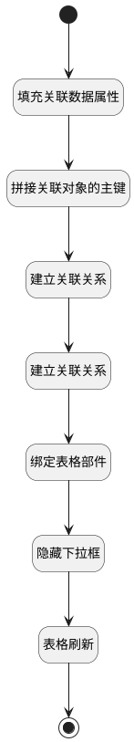

## 建立双向关联数据 <!-- {docsify-ignore-all} -->

   1.工作项表格「 关联工作项 」按钮 后附加
2.测试计划, 新建缺陷后附加

### 处理过程




### 处理步骤说明

#### 开始 :id=Begin


#### 结束 :id=END1


#### 拼接关联对象的主键 :id=RAWJSCODE1


<p class="panel-title"><b>执行代码</b></p>

```javascript
let relationobj = uiLogic.relation;
relationobj.id = relationobj.principal_id + "_" + relationobj.target_id;
let relation2 = uiLogic.relation2;
relation2.id = relation2.principal_id + "_" + relation2.target_id;

```

#### 表格刷新 :id=VIEWCTRLINVOKE1


调用`grid(表格对象)`的方法`refresh`，参数为`grid(表格对象)`
#### 绑定表格部件 :id=PREPAREJSPARAM2


1. 将`view(当前视图对象).layoutPanel.panelItems.grid.control` 设置给  `grid(表格对象)`

#### 填充关联数据属性 :id=PREPAREJSPARAM1


1. 将`ctx.principal_type` 设置给  `relation(正向关联对象).principal_type`
2. 将`ctx.target_type` 设置给  `relation2(反向关联对象).principal_type`
3. 将`ctx.principal_type` 设置给  `relation2(反向关联对象).target_type`
4. 将`ctx.principal_id` 设置给  `relation2(反向关联对象).target_id`
5. 将`Default(传入变量).id` 设置给  `relation2(反向关联对象).principal_id`
6. 将`ctx.principal_id` 设置给  `relation(正向关联对象).principal_id`
7. 将`Default(传入变量).id` 设置给  `relation(正向关联对象).target_id`
8. 将`ctx.target_type` 设置给  `relation(正向关联对象).target_type`

#### 建立关联关系 :id=DEACTION1


调用实体 [关联(RELATION)](module/Base/Relation.md) 行为 [Create](module/Base/Relation#行为) ，行为参数为`relation(正向关联对象)`

将执行结果返回给参数`relation(正向关联对象)`

#### 隐藏下拉框 :id=RAWJSCODE2


<p class="panel-title"><b>执行代码</b></p>

```javascript
const panel = view.layoutPanel.panelItems.choose_data;
if (panel) {
    panel.state.visible = false;
}
```

#### 建立关联关系 :id=DEACTION2


调用实体 [关联(RELATION)](module/Base/Relation.md) 行为 [Create](module/Base/Relation#行为) ，行为参数为`relation2(反向关联对象)`


### 实体逻辑参数

|    中文名   |    代码名    |  数据类型      |备注 |
| --------| --------| --------  | --------   |
|ctx|ctx|导航视图参数绑定参数||
|反向关联对象|relation2|数据对象||
|表格对象|grid|部件对象||
|传入变量(<i class="fa fa-check"/></i>)|Default|数据对象||
|当前视图对象|view|当前视图对象||
|正向关联对象|relation|数据对象||
