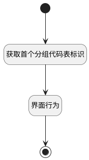

## 新建用户故事（kanban）（工具栏） <!-- {docsify-ignore-all} -->

   

### 处理过程

### 处理步骤说明

#### 开始 :id=Begin

#### 界面行为 :id=DEUIACTION1

调用实体 [工作项(WORK_ITEM)](module/ProjMgmt/Work_item.md) 界面行为 [新建用户故事（kanban）](module/ProjMgmt/Work_item#界面行为) ，行为参数为`Default(传入变量)`

#### 获取首个分组代码表标识 :id=PREPAREJSPARAM1

1. 将`kanban(看板).groupCodeListItems[0].value` 设置给  `Default(传入变量).srfgroup`

#### 结束 :id=END1

### 实体逻辑参数

|    中文名   |    代码名    |  数据类型      |备注 |
| --------| --------| --------  | --------   |
|传入变量(<i class="fa fa-check"/></i>)|Default|数据对象||
|看板|kanban|部件对象||
