## 设置表单状态 <!-- {docsify-ignore-all} -->

   控制回收站表单只读

### 处理过程

```plantuml
@startuml
hide footbox
<style>
root {
  HyperlinkColor #42b983
}
</style>

hide empty description
state "开始" as Begin <<start>> [[$./set_form_readonly#begin {开始}]]
state "设置表单只读" as PREPAREJSPARAM1  [[$./set_form_readonly#preparejsparam1 {设置表单只读}]]
state "结束" as END1 <<end>> [[$./set_form_readonly#end1 {结束}]]


Begin --> PREPAREJSPARAM1 : [[$./set_form_readonly#begin-preparejsparam1{已删除数据} 已删除数据]]
PREPAREJSPARAM1 --> END1


@enduml
```




### 处理步骤说明

#### 开始 :id=Begin


#### 设置表单只读 :id=PREPAREJSPARAM1


1. 将`true` 设置给  `VIEW(视图).context.srfreadonly`

#### 结束 :id=END1


### 连接条件说明
#### 已删除数据 :id=Begin-PREPAREJSPARAM1

```FORM(表单).data.is_deleted``` EQ ```1```


### 实体逻辑参数

|    中文名   |    代码名    |  数据类型      |备注 |
| --------| --------| --------  | --------   |
|视图|VIEW|当前视图对象||
|表单|FORM|当前部件对象||
|传入变量(<i class="fa fa-check"/></i>)|Default|数据对象||
