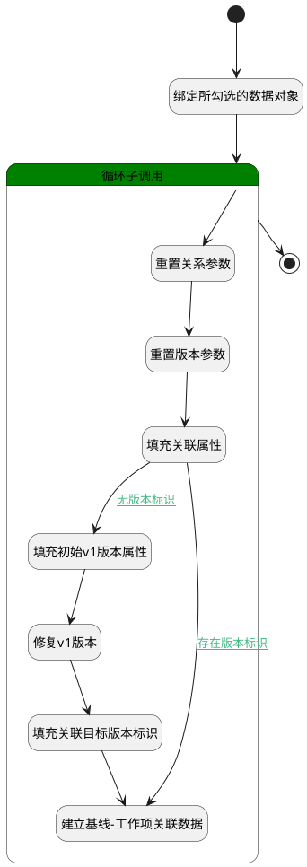

## 移入基线 <!-- {docsify-ignore-all} -->

   将工作项移入对应基线

### 处理过程




### 处理步骤说明

#### 开始 :id=Begin<sup class="footnote-symbol"> <font color=gray size=1>[开始]</font></sup>


*- N/A*
#### 填充初始v1版本属性 :id=PREPAREPARAM2<sup class="footnote-symbol"> <font color=gray size=1>[准备参数]</font></sup>


1. 将`for_temp_obj(循环临时变量).ID(标识)` 设置给  `version(版本).OWNER_ID(所属数据标识)`
2. 将`初始化创建` 设置给  `version(版本).DESCRIPTION(描述)`
3. 将`WORK_ITEM` 设置给  `version(版本).OWNER_TYPE(所属数据对象)`

#### 修复v1版本 :id=DEACTION2<sup class="footnote-symbol"> <font color=gray size=1>[实体行为]</font></sup>


调用实体 [版本(VERSION)](module/Base/version.md) 行为 [修复版本(FixCommit)](module/Base/version#行为) ，行为参数为`version(版本)`

将执行结果返回给参数`version(版本)`

#### 填充关联目标版本标识 :id=PREPAREPARAM3<sup class="footnote-symbol"> <font color=gray size=1>[准备参数]</font></sup>


1. 将`version(版本).ID(标识)` 设置给  `relation(关联对象).TARGET_VERSION_ID(目标对象版本标识)`

#### 绑定所勾选的数据对象 :id=BINDPARAM1<sup class="footnote-symbol"> <font color=gray size=1>[绑定参数]</font></sup>


绑定参数`Default(传入变量)` 到 `srfactionparam(选择数据列表)`
#### 循环子调用 :id=LOOPSUBCALL1<sup class="footnote-symbol"> <font color=gray size=1>[循环子调用]</font></sup>


循环参数`srfactionparam(选择数据列表)`，子循环参数使用`for_temp_obj(循环临时变量)`
#### 重置关系参数 :id=RESETPARAM1<sup class="footnote-symbol"> <font color=gray size=1>[重置参数]</font></sup>


重置参数```relation(关联对象)```
#### 重置版本参数 :id=RESETPARAM2<sup class="footnote-symbol"> <font color=gray size=1>[重置参数]</font></sup>


重置参数```version(版本)```
#### 填充关联属性 :id=PREPAREPARAM1<sup class="footnote-symbol"> <font color=gray size=1>[准备参数]</font></sup>


1. 将`Default(传入变量).baseline_id` 设置给  `relation(关联对象).PRINCIPAL_ID(关联主体标识)`
2. 将`for_temp_obj(循环临时变量).CHOOSE_VERSION_ID(选择版本标识)` 设置给  `relation(关联对象).TARGET_VERSION_ID(目标对象版本标识)`
3. 将`for_temp_obj(循环临时变量).ID(标识)` 设置给  `relation(关联对象).TARGET_ID(关联目标标识)`
4. 将`work_item` 设置给  `relation(关联对象).TARGET_TYPE(关联目标类型)`
5. 将`baseline` 设置给  `relation(关联对象).PRINCIPAL_TYPE(关联主体类型)`

#### 建立基线-工作项关联数据 :id=DEACTION1<sup class="footnote-symbol"> <font color=gray size=1>[实体行为]</font></sup>


调用实体 [关联(RELATION)](module/Base/relation.md) 行为 [Save](module/Base/relation#行为) ，行为参数为`relation(关联对象)`

#### 结束 :id=END1<sup class="footnote-symbol"> <font color=gray size=1>[结束]</font></sup>


*- N/A*


### 连接条件说明
#### 无版本标识 :id=PREPAREPARAM1-PREPAREPARAM2

`for_temp_obj(循环临时变量).CHOOSE_VERSION_ID(选择版本标识)` ISNULL AND `for_temp_obj(循环临时变量).CHOOSE_VERSION_NAME(选择版本名称)` EQ `v1`
#### 存在版本标识 :id=PREPAREPARAM1-DEACTION1

`for_temp_obj(循环临时变量).CHOOSE_VERSION_ID(选择版本标识)` ISNOTNULL


### 实体逻辑参数

|    中文名   |    代码名    |  数据类型    |  实体   |备注 |
| --------| --------| -------- | -------- | --------   |
|传入变量(<i class="fa fa-check"/></i>)|Default|数据对象|[基线工作项(BASELINE_WORK_ITEM)](module/ProjMgmt/baseline_work_item.md)||
|循环临时变量|for_temp_obj|数据对象|[工作项(WORK_ITEM)](module/ProjMgmt/work_item.md)||
|关联对象|relation|数据对象|[关联(RELATION)](module/Base/relation.md)||
|选择数据列表|srfactionparam|数据对象列表|[工作项(WORK_ITEM)](module/ProjMgmt/work_item.md)||
|版本|version|数据对象|[版本(VERSION)](module/Base/version.md)||
