## 快照设立基线 <!-- {docsify-ignore-all} -->

   快照设立基线

### 处理过程

```plantuml
@startuml
hide empty description
<style>
root {
  HyperlinkColor #42b983
}
</style>

hide empty description
state "开始" as Begin <<start>> [[$./snapshot_set_baseline#begin {"开始"}]]
state "设值基线状态为打开" as PREPAREPARAM1  [[$./snapshot_set_baseline#prepareparam1 {"设值基线状态为打开"}]]
state "设立基线" as DEACTION1  [[$./snapshot_set_baseline#deaction1 {"设立基线"}]]
state "结束" as END1 <<end>> [[$./snapshot_set_baseline#end1 {"结束"}]]


Begin --> PREPAREPARAM1
PREPAREPARAM1 --> DEACTION1
DEACTION1 --> END1


@enduml
```

### 处理步骤说明

#### 开始 :id=Begin [开始]

*- N/A*
#### 设值基线状态为打开 :id=PREPAREPARAM1 [准备参数]

1. 将`1` 设置给  `baseline(基线对象).STATUS(状态)`
2. 将`Default(传入变量).baseline_id` 设置给  `baseline(基线对象).ID(标识)`

#### 设立基线 :id=DEACTION1 [实体行为]

调用实体 [基线(BASELINE)](module/Base/baseline.md) 行为 [Update](module/Base/baseline#行为) ，行为参数为`baseline(基线对象)`

#### 结束 :id=END1 [结束]

返回 `baseline(基线对象)`

### 实体逻辑参数

|    中文名   |    代码名    |  数据类型    |  实体   |备注 |
| --------| --------| -------- | -------- | --------   |
|传入变量(<i class="fa fa-check"/></i>)|Default|数据对象|[基线工作项(BASELINE_WORK_ITEM)](module/ProjMgmt/baseline_work_item.md)||
|基线对象|baseline|数据对象|[基线(BASELINE)](module/Base/baseline.md)||
