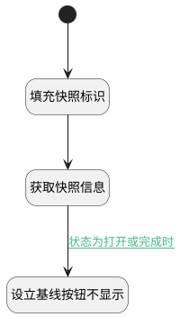

## 规划快照查看 <!-- {docsify-ignore-all} -->

   规划快照查看：打开快照甘特图视图时依据快照状态，显示操作按钮

### 处理过程




### 处理步骤说明

#### 开始 :id=Begin<sup class="footnote-symbol"> <font color=gray size=1>[开始]</font></sup>


#### 填充快照标识 :id=PREPAREJSPARAM1<sup class="footnote-symbol"> <font color=gray size=1>[准备参数]</font></sup>


1. 将`ctx(上下文变量).baseline` 设置给  `plan_snapshot(规划快照对象).id`

#### 获取快照信息 :id=DEACTION1<sup class="footnote-symbol"> <font color=gray size=1>[实体行为]</font></sup>


调用实体 [基线(BASELINE)](module/Base/baseline.md) 行为 [Get](module/Base/baseline#行为) ，行为参数为`plan_snapshot(规划快照对象)`

将执行结果返回给参数`plan_snapshot(规划快照对象)`

#### 设立基线按钮不显示 :id=RAWJSCODE1<sup class="footnote-symbol"> <font color=gray size=1>[直接前台代码]</font></sup>


<p class="panel-title"><b>执行代码</b></p>

```javascript
view.layoutPanel.panelItems.toolbar.state.visible = false;
```

### 连接条件说明
#### 状态为打开或完成时 :id=DEACTION1-RAWJSCODE1

(```plan_snapshot(规划快照对象).status``` EQ ```1``` OR ```plan_snapshot(规划快照对象).status``` EQ ```2```)


### 实体逻辑参数

|    中文名   |    代码名    |  数据类型      |备注 |
| --------| --------| --------  | --------   |
|传入变量(<i class="fa fa-check"/></i>)|Default|数据对象||
|规划快照对象|plan_snapshot|数据对象||
|上下文变量|ctx|导航视图参数绑定参数||
