## 移出基线后刷新表格 <!-- {docsify-ignore-all} -->

   移出基线后刷新表格

### 处理过程

```plantuml
@startuml
hide footbox
<style>
root {
  HyperlinkColor #42b983
}
</style>

hide empty description
state "开始" as Begin <<start>> [[$./shift_out_refresh#begin {开始}]]
state "视图部件调用" as VIEWCTRLINVOKE1  [[$./shift_out_refresh#viewctrlinvoke1 {视图部件调用}]]
state "绑定表格对象" as PREPAREJSPARAM1  [[$./shift_out_refresh#preparejsparam1 {绑定表格对象}]]


Begin --> PREPAREJSPARAM1
PREPAREJSPARAM1 --> VIEWCTRLINVOKE1


@enduml
```

### 处理步骤说明

#### 开始 :id=Begin [开始]

#### 绑定表格对象 :id=PREPAREJSPARAM1 [准备参数]

1. 将`view(当前视图对象).layoutPanel.panelItems.grid.control` 设置给  `grid(表格对象)`

#### 视图部件调用 :id=VIEWCTRLINVOKE1 [视图部件调用]

调用`grid(表格对象)`的方法`refresh`，参数为`grid(表格对象)`

### 实体逻辑参数

|    中文名   |    代码名    |  数据类型      |备注 |
| --------| --------| --------  | --------   |
|传入变量(<i class="fa fa-check"/></i>)|Default|数据对象||
|表格对象|grid|部件对象||
|当前视图对象|view|当前视图对象||
