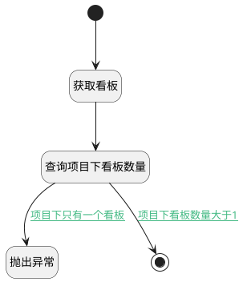

## 删除看板之前判断 <!-- {docsify-ignore-all} -->

   删除看板之前，判断项目下看板数量。必须保留一个看板

### 处理过程




### 处理步骤说明

#### 开始 :id=Begin<sup class="footnote-symbol"> <font color=gray size=1>[开始]</font></sup>


*- N/A*
#### 获取看板 :id=DEACTION1<sup class="footnote-symbol"> <font color=gray size=1>[实体行为]</font></sup>


调用实体 [看板(BOARD)](module/ProjMgmt/board.md) 行为 [Get](module/ProjMgmt/board#行为) ，行为参数为`Default(传入变量)`

将执行结果返回给参数`Default(传入变量)`

#### 查询项目下看板数量 :id=RAWSQLCALL1<sup class="footnote-symbol"> <font color=gray size=1>[直接SQL调用]</font></sup>


<p class="panel-title"><b>执行sql语句</b></p>

```sql
select count(1) as project_with_board_num from `board` where project_id = ?
```

<p class="panel-title"><b>执行sql参数</b></p>

1. `Default(传入变量).PROJECT_ID(产品标识)`

重置参数`project(项目)`，并将执行sql结果赋值给参数`project(项目)`

#### 抛出异常 :id=THROWEXCEPTION1<sup class="footnote-symbol"> <font color=gray size=1>[抛出异常]</font></sup>


> [!ATTENTION|label:抛出异常|icon:fa fa-warning]
> 错误信息：项目中至少保留一个看板

#### 结束 :id=END1<sup class="footnote-symbol"> <font color=gray size=1>[结束]</font></sup>


*- N/A*


### 连接条件说明
#### 项目下只有一个看板 :id=RAWSQLCALL1-THROWEXCEPTION1

`project(项目).project_with_board_num` EQ `1`
#### 项目下看板数量大于1 :id=RAWSQLCALL1-END1

`project(项目).project_with_board_num` GT `1`


### 实体逻辑参数

|    中文名   |    代码名    |  数据类型    |  实体   |备注 |
| --------| --------| -------- | -------- | --------   |
|传入变量(<i class="fa fa-check"/></i>)|Default|数据对象|[看板(BOARD)](module/ProjMgmt/board.md)||
|项目|project|数据对象|[项目(PROJECT)](module/ProjMgmt/project.md)||
