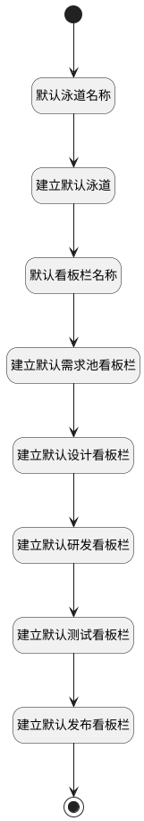

## 生成默认看板栏和泳道 <!-- {docsify-ignore-all} -->

   新建看板项目后，会附加生成出默认看板栏和泳道

### 处理过程

### 处理步骤说明

#### 开始 :id=Begin [开始]

*- N/A*
#### 默认泳道名称 :id=PREPAREPARAM2 [准备参数]

1. 将`默认泳道` 设置给  `swimlane(默认泳道).NAME(名称)`
2. 将`Default(传入变量).ID(标识)` 设置给  `swimlane(默认泳道).ID(标识)`
3. 将`Default(传入变量).ID(标识)` 设置给  `swimlane(默认泳道).BOARD_ID(看板标识)`

#### 建立默认泳道 :id=DEACTION2 [实体行为]

调用实体 [泳道(SWIMLANE)](module/ProjMgmt/swimlane.md) 行为 [Create](module/ProjMgmt/swimlane#行为) ，行为参数为`swimlane(默认泳道)`

将执行结果返回给参数`swimlane(默认泳道)`

#### 默认看板栏名称 :id=PREPAREPARAM3 [准备参数]

1. 将`0` 设置给  `idea_pool_entry(需求池看板栏).IS_SPLIT(是否将看板栏拆分为进行中和已完成)`
2. 将`1` 设置给  `idea_pool_entry(需求池看板栏).SHOWORDER(排序)`
3. 将`2` 设置给  `design_entry(设计看板栏).SHOWORDER(排序)`
4. 将`3` 设置给  `rd_entry(研发看板栏).SHOWORDER(排序)`
5. 将`4` 设置给  `test_entry(测试看板栏).SHOWORDER(排序)`
6. 将`5` 设置给  `issue_entry(发布看板栏).SHOWORDER(排序)`
7. 将`1` 设置给  `idea_pool_entry(需求池看板栏).IS_SYSTEM(是否系统标记)`
8. 将`0` 设置给  `design_entry(设计看板栏).IS_SPLIT(是否将看板栏拆分为进行中和已完成)`
9. 将`0` 设置给  `design_entry(设计看板栏).IS_SYSTEM(是否系统标记)`
10. 将`1` 设置给  `rd_entry(研发看板栏).IS_SPLIT(是否将看板栏拆分为进行中和已完成)`
11. 将`0` 设置给  `rd_entry(研发看板栏).IS_SYSTEM(是否系统标记)`
12. 将`0` 设置给  `test_entry(测试看板栏).IS_SPLIT(是否将看板栏拆分为进行中和已完成)`
13. 将`0` 设置给  `test_entry(测试看板栏).IS_SPLIT(是否将看板栏拆分为进行中和已完成)`
14. 将`0` 设置给  `issue_entry(发布看板栏).IS_SPLIT(是否将看板栏拆分为进行中和已完成)`
15. 将`0` 设置给  `issue_entry(发布看板栏).IS_SYSTEM(是否系统标记)`
16. 将`Default(传入变量).ID(标识)` 设置给  `idea_pool_entry(需求池看板栏).BOARD_ID(看板标识)`
17. 将`Default(传入变量).ID(标识)` 设置给  `design_entry(设计看板栏).BOARD_ID(看板标识)`
18. 将`Default(传入变量).ID(标识)` 设置给  `rd_entry(研发看板栏).BOARD_ID(看板标识)`
19. 将`Default(传入变量).ID(标识)` 设置给  `test_entry(测试看板栏).BOARD_ID(看板标识)`
20. 将`Default(传入变量).ID(标识)` 设置给  `issue_entry(发布看板栏).BOARD_ID(看板标识)`
21. 将`需求池` 设置给  `idea_pool_entry(需求池看板栏).NAME(名称)`
22. 将`设计` 设置给  `design_entry(设计看板栏).NAME(名称)`
23. 将`研发` 设置给  `rd_entry(研发看板栏).NAME(名称)`
24. 将`测试` 设置给  `test_entry(测试看板栏).NAME(名称)`
25. 将`发布` 设置给  `issue_entry(发布看板栏).NAME(名称)`

#### 建立默认需求池看板栏 :id=DEACTION3 [实体行为]

调用实体 [看板栏(ENTRY)](module/ProjMgmt/entry.md) 行为 [Create](module/ProjMgmt/entry#行为) ，行为参数为`idea_pool_entry(需求池看板栏)`

将执行结果返回给参数`idea_pool_entry(需求池看板栏)`

#### 建立默认设计看板栏 :id=DEACTION4 [实体行为]

调用实体 [看板栏(ENTRY)](module/ProjMgmt/entry.md) 行为 [Create](module/ProjMgmt/entry#行为) ，行为参数为`design_entry(设计看板栏)`

将执行结果返回给参数`design_entry(设计看板栏)`

#### 建立默认研发看板栏 :id=DEACTION5 [实体行为]

调用实体 [看板栏(ENTRY)](module/ProjMgmt/entry.md) 行为 [Create](module/ProjMgmt/entry#行为) ，行为参数为`rd_entry(研发看板栏)`

将执行结果返回给参数`rd_entry(研发看板栏)`

#### 建立默认测试看板栏 :id=DEACTION6 [实体行为]

调用实体 [看板栏(ENTRY)](module/ProjMgmt/entry.md) 行为 [Create](module/ProjMgmt/entry#行为) ，行为参数为`test_entry(测试看板栏)`

将执行结果返回给参数`test_entry(测试看板栏)`

#### 建立默认发布看板栏 :id=DEACTION7 [实体行为]

调用实体 [看板栏(ENTRY)](module/ProjMgmt/entry.md) 行为 [Create](module/ProjMgmt/entry#行为) ，行为参数为`issue_entry(发布看板栏)`

将执行结果返回给参数`issue_entry(发布看板栏)`

#### 结束 :id=END1 [结束]

*- N/A*

### 实体逻辑参数

|    中文名   |    代码名    |  数据类型    |  实体   |备注 |
| --------| --------| -------- | -------- | --------   |
|传入变量(<i class="fa fa-check"/></i>)|Default|数据对象|[看板(BOARD)](module/ProjMgmt/board.md)||
|默认看板|board|数据对象|[看板(BOARD)](module/ProjMgmt/board.md)||
|设计看板栏|design_entry|数据对象|[看板栏(ENTRY)](module/ProjMgmt/entry.md)||
|需求池看板栏|idea_pool_entry|数据对象|[看板栏(ENTRY)](module/ProjMgmt/entry.md)||
|发布看板栏|issue_entry|数据对象|[看板栏(ENTRY)](module/ProjMgmt/entry.md)||
|研发看板栏|rd_entry|数据对象|[看板栏(ENTRY)](module/ProjMgmt/entry.md)||
|默认泳道|swimlane|数据对象|[泳道(SWIMLANE)](module/ProjMgmt/swimlane.md)||
|测试看板栏|test_entry|数据对象|[看板栏(ENTRY)](module/ProjMgmt/entry.md)||
