## 看板删除后附加逻辑 <!-- {docsify-ignore-all} -->

   看板删除后附加逻辑：是否当前看板正在预览；删除后需切换

### 处理过程

```plantuml
@startuml
hide footbox
<style>
root {
  HyperlinkColor #42b983
}
</style>

hide empty description
state "开始" as Begin <<start>> [[$./after_board_remove#begin {开始}]]
state "计算删除看板id" as RAWJSCODE1  [[$./after_board_remove#rawjscode1 {计算删除看板id}]]
state "结束" as END1 <<end>> [[$./after_board_remove#end1 {结束}]]
state "界面行为" as DEUIACTION1  [[$./after_board_remove#deuiaction1 {界面行为}]]


Begin --> RAWJSCODE1
RAWJSCODE1 --> DEUIACTION1
DEUIACTION1 --> END1


@enduml
```




### 处理步骤说明

#### 开始 :id=Begin<sup class="footnote-symbol"> <font color=gray size=1>[开始]</font></sup>


#### 结束 :id=END1<sup class="footnote-symbol"> <font color=gray size=1>[结束]</font></sup>


#### 计算删除看板id :id=RAWJSCODE1<sup class="footnote-symbol"> <font color=gray size=1>[直接前台代码]</font></sup>


<p class="panel-title"><b>执行代码</b></p>

```javascript
if (context.board === context.curboard) {
    context.srfdefaulttoroutedepth = 3;
    context.board = context.project;
}
```

#### 界面行为 :id=DEUIACTION1<sup class="footnote-symbol"> <font color=gray size=1>[实体界面行为调用]</font></sup>


调用实体 [看板(BOARD)](module/ProjMgmt/board.md) 界面行为 [打开默认看板](module/ProjMgmt/board#界面行为) ，行为参数为`data(数据)`


### 实体逻辑参数

|    中文名   |    代码名    |  数据类型      |备注 |
| --------| --------| --------  | --------   |
|传入变量(<i class="fa fa-check"/></i>)|Default|数据对象||
|当前视图|view|当前视图对象||
|数据|data|数据对象||
