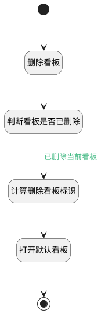

## 看板删除逻辑 <!-- {docsify-ignore-all} -->

   看板删除逻辑：是否当前看板正在预览；删除后需切换至默认看板下

### 处理过程




### 处理步骤说明

#### 开始 :id=Begin<sup class="footnote-symbol"> <font color=gray size=1>[开始]</font></sup>


#### 删除看板 :id=DEUIACTION2<sup class="footnote-symbol"> <font color=gray size=1>[实体界面行为调用]</font></sup>


调用实体 [看板(BOARD)](module/ProjMgmt/board.md) 界面行为 [表格界面_删除操作](module/ProjMgmt/board#界面行为) ，行为参数为`Default(传入变量)`

#### 判断看板是否已删除 :id=DEACTION1<sup class="footnote-symbol"> <font color=gray size=1>[实体行为]</font></sup>


调用实体 [看板(BOARD)](module/ProjMgmt/board.md) 行为 [判断看板是否已删除(check_board_is_deleted)](module/ProjMgmt/board#行为) ，行为参数为`Default(传入变量)`

将执行结果返回给参数`Default(传入变量)`

#### 计算删除看板标识 :id=RAWJSCODE1<sup class="footnote-symbol"> <font color=gray size=1>[直接前台代码]</font></sup>


<p class="panel-title"><b>执行代码</b></p>

```javascript
if (uiLogic.default.id === context.curboard) {
    context.srfdefaulttoroutedepth = 3;
    context.board = context.project;
}
```

#### 打开默认看板 :id=DEUIACTION1<sup class="footnote-symbol"> <font color=gray size=1>[实体界面行为调用]</font></sup>


调用实体 [看板(BOARD)](module/ProjMgmt/board.md) 界面行为 [打开默认看板](module/ProjMgmt/board#界面行为) ，行为参数为`data(数据)`

#### 结束 :id=END1<sup class="footnote-symbol"> <font color=gray size=1>[结束]</font></sup>


### 连接条件说明
#### 已删除当前看板 :id=DEACTION1-RAWJSCODE1

```Default(传入变量).checkkey``` EQ ```0``` AND 


### 实体逻辑参数

|    中文名   |    代码名    |  数据类型      |备注 |
| --------| --------| --------  | --------   |
|数据|data|数据对象||
|当前视图|view|当前视图对象||
|上下文变量|context|导航视图参数绑定参数||
|传入变量(<i class="fa fa-check"/></i>)|Default|数据对象||
|checkKey|checkKey|简单数据||
