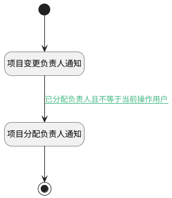

## 负责人变更附加逻辑 <!-- {docsify-ignore-all} -->

   项目负责人变更时触发相应的通知消息

### 处理过程

### 处理步骤说明

#### 开始 :id=Begin [开始]

*- N/A*
#### 项目变更负责人通知 :id=DENOTIFY1 [实体通知]

调用实体 [项目(PROJECT)](module/ProjMgmt/project.md) 通知 [项目变更负责人通知(change_assignee_notify)](module/ProjMgmt/project/notify/change_assignee_notify) ，参数为`Default(传入变量)`
#### 项目分配负责人通知 :id=DENOTIFY2 [实体通知]

调用实体 [项目(PROJECT)](module/ProjMgmt/project.md) 通知 [项目分配负责人通知(assignee_notify)](module/ProjMgmt/project/notify/assignee_notify) ，参数为`Default(传入变量)`
#### 结束 :id=END1 [结束]

*- N/A*

### 连接条件说明
#### 已分配负责人且不等于当前操作用户 :id=DENOTIFY1-DENOTIFY2

`Default(传入变量).ASSIGNEE_ID(负责人标识)` ISNOTNULL AND 

### 实体逻辑参数

|    中文名   |    代码名    |  数据类型    |  实体   |备注 |
| --------| --------| -------- | -------- | --------   |
|传入变量(<i class="fa fa-check"/></i>)|Default|数据对象|[项目(PROJECT)](module/ProjMgmt/project.md)||
