## 复制项目信息 <!-- {docsify-ignore-all} -->

   

### 处理过程

```plantuml
@startuml
hide empty description
<style>
root {
  HyperlinkColor #42b983
}
</style>

hide empty description
state "开始" as Begin <<start>> [[$./copy_project_info#begin {"开始"}]]
state "获取目标项目数据" as DEACTION_01  [[$./copy_project_info#deaction_01 {"获取目标项目数据"}]]
state "执行脚本代码" as RAWSFCODE_01  [[$./copy_project_info#rawsfcode_01 {"执行脚本代码"}]]
state "结束" as END_01 <<end>> [[$./copy_project_info#end_01 {"结束"}]]


Begin --> DEACTION_01
DEACTION_01 --> RAWSFCODE_01
RAWSFCODE_01 --> END_01


@enduml
```




### 处理步骤说明

#### 获取目标项目数据 :id=DEACTION_01<sup class="footnote-symbol"> <font color=gray size=1>[实体行为]</font></sup>


调用实体 [项目(PROJECT)](module/ProjMgmt/project.md) 行为 [Get](module/ProjMgmt/project#行为) ，行为参数为`Default(传入变量)`

将执行结果返回给参数`project`

#### 开始 :id=Begin<sup class="footnote-symbol"> <font color=gray size=1>[开始]</font></sup>


*- N/A*
#### 执行脚本代码 :id=RAWSFCODE_01<sup class="footnote-symbol"> <font color=gray size=1>[直接后台代码]</font></sup>


<p class="panel-title"><b>执行代码[Groovy]</b></p>

```groovy
def project = logic.param('project').getReal()
project.id = null
project.identifier = 'PROJ' + UUID.randomUUID().toString().replaceAll('-', '').toUpperCase().take(11)
logic.param('project').getDataEntityRuntime().fillEntityKeyValue(project)
```

#### 结束 :id=END_01<sup class="footnote-symbol"> <font color=gray size=1>[结束]</font></sup>


返回 `project`


### 实体逻辑参数

|    中文名   |    代码名    |  数据类型    |  实体   |备注 |
| --------| --------| -------- | -------- | --------   |
|传入变量(<i class="fa fa-check"/></i>)|Default|数据对象|[项目(PROJECT)](module/ProjMgmt/project.md)||
|project|project|数据对象|[项目(PROJECT)](module/ProjMgmt/project.md)||
