## 生成默认看板 <!-- {docsify-ignore-all} -->

   新建看板项目后，会附加生成出默认看板

### 处理过程

```plantuml
@startuml
hide empty description
<style>
root {
  HyperlinkColor #42b983
}
</style>

hide empty description
state "开始" as Begin <<start>> [[$./create_default_board#begin {"开始"}]]
state "默认看板名称" as PREPAREPARAM1  [[$./create_default_board#prepareparam1 {"默认看板名称"}]]
state "建立默认看板" as DEACTION1  [[$./create_default_board#deaction1 {"建立默认看板"}]]
state "结束" as END1 <<end>> [[$./create_default_board#end1 {"结束"}]]


Begin --> PREPAREPARAM1 : [[$./create_default_board#begin-prepareparam1{如果新建看板项目} 如果新建看板项目]]
PREPAREPARAM1 --> DEACTION1
DEACTION1 --> END1


@enduml
```

### 处理步骤说明

#### 开始 :id=Begin [开始]

*- N/A*
#### 默认看板名称 :id=PREPAREPARAM1 [准备参数]

1. 将`默认看板` 设置给  `board(默认看板).NAME(名称)`
2. 将`Default(传入变量).ID(标识)` 设置给  `board(默认看板).ID(标识)`
3. 将`Default(传入变量).ID(标识)` 设置给  `board(默认看板).PROJECT_ID(产品标识)`

#### 建立默认看板 :id=DEACTION1 [实体行为]

调用实体 [看板(BOARD)](module/ProjMgmt/board.md) 行为 [Create](module/ProjMgmt/board#行为) ，行为参数为`board(默认看板)`

将执行结果返回给参数`board(默认看板)`

#### 结束 :id=END1 [结束]

*- N/A*

### 连接条件说明
#### 如果新建看板项目 :id=Begin-PREPAREPARAM1

`Default(传入变量).TYPE(类型)` EQ `kanban`

### 实体逻辑参数

|    中文名   |    代码名    |  数据类型    |  实体   |备注 |
| --------| --------| -------- | -------- | --------   |
|传入变量(<i class="fa fa-check"/></i>)|Default|数据对象|[项目(PROJECT)](module/ProjMgmt/project.md)||
|默认看板|board|数据对象|[看板(BOARD)](module/ProjMgmt/board.md)||
|设计看板栏|design_entry|数据对象|[看板栏(ENTRY)](module/ProjMgmt/entry.md)||
|需求池看板栏|idea_pool_entry|数据对象|[看板栏(ENTRY)](module/ProjMgmt/entry.md)||
|发布看板栏|issue_entry|数据对象|[看板栏(ENTRY)](module/ProjMgmt/entry.md)||
|研发看板栏|rd_entry|数据对象|[看板栏(ENTRY)](module/ProjMgmt/entry.md)||
|默认泳道|swimlane|数据对象|[泳道(SWIMLANE)](module/ProjMgmt/swimlane.md)||
|测试看板栏|test_entry|数据对象|[看板栏(ENTRY)](module/ProjMgmt/entry.md)||
