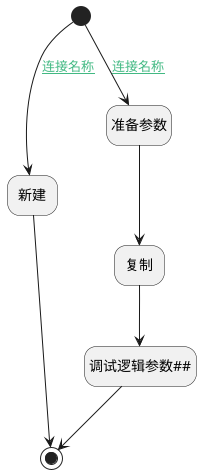

## 使用模板创建项目 <!-- {docsify-ignore-all} -->

   

### 处理过程

### 处理步骤说明

#### 开始 :id=Begin [开始]

*- N/A*
#### 准备参数 :id=PREPAREPARAM_01 [准备参数]

1. 将`Default(传入变量).project_template_id(项目模板标识)` 设置给  `Default(传入变量).id(标识)`

#### 新建 :id=DEACTION_01 [实体行为]

调用实体 [项目(PROJECT)](module/ProjMgmt/project.md) 行为 [Create](module/ProjMgmt/project#行为) ，行为参数为`Default(传入变量)`

将执行结果返回给参数`Default(传入变量)`

#### 复制 :id=DEACTION_02 [实体行为]

调用实体 [项目(PROJECT)](module/ProjMgmt/project.md) 行为 [复制(Copy)](module/ProjMgmt/project#行为) ，行为参数为`Default(传入变量)`

将执行结果返回给参数`Default(传入变量)`

#### 调试逻辑参数## :id=DEBUGPARAM_01 [调试逻辑参数]

> [!NOTE|label:调试信息|icon:fa fa-bug]
> 调试输出参数`Default(传入变量)`的详细信息

#### 结束 :id=END_01 [结束]

返回 `Default(传入变量)`

### 连接条件说明
#### 连接名称 :id=Begin-DEACTION_01

`Default(传入变量).project_template_id(项目模板标识)` ISNULL
#### 连接名称 :id=Begin-PREPAREPARAM_01

`Default(传入变量).project_template_id(项目模板标识)` ISNOTNULL

### 实体逻辑参数

|    中文名   |    代码名    |  数据类型    |  实体   |备注 |
| --------| --------| -------- | -------- | --------   |
|传入变量(<i class="fa fa-check"/></i>)|Default|数据对象|[项目(PROJECT)](module/ProjMgmt/project.md)||
