## 填充复制项目信息 <!-- {docsify-ignore-all} -->

   复制项目时，填充当前项目的基本信息

### 处理过程

```plantuml
@startuml
hide empty description
<style>
root {
  HyperlinkColor #42b983
}
</style>

hide empty description
state "开始" as Begin <<start>> [[$./fill_copy_info#begin {"开始"}]]
state "获取目标项目数据" as DEACTION1  [[$./fill_copy_info#deaction1 {"获取目标项目数据"}]]
state "创建临时数据" as DEACTION2  [[$./fill_copy_info#deaction2 {"创建临时数据"}]]
state "结束" as END1 <<end>> [[$./fill_copy_info#end1 {"结束"}]]


Begin --> DEACTION1
DEACTION1 --> DEACTION2
DEACTION2 --> END1


@enduml
```

### 处理步骤说明

#### 开始 :id=Begin [开始]

*- N/A*
#### 获取目标项目数据 :id=DEACTION1 [实体行为]

调用实体 [项目(PROJECT)](module/ProjMgmt/project.md) 行为 [Get](module/ProjMgmt/project#行为) ，行为参数为`Default(传入变量)`

将执行结果返回给参数`project(项目)`

#### 创建临时数据 :id=DEACTION2 [实体行为]

调用实体 [项目(PROJECT)](module/ProjMgmt/project.md) 行为 [CreateTemp](module/ProjMgmt/project#行为) ，行为参数为`project(项目)`

将执行结果返回给参数`project(项目)`

#### 结束 :id=END1 [结束]

返回 `project(项目)`

### 实体逻辑参数

|    中文名   |    代码名    |  数据类型    |  实体   |备注 |
| --------| --------| -------- | -------- | --------   |
|传入变量(<i class="fa fa-check"/></i>)|Default|数据对象|[项目(PROJECT)](module/ProjMgmt/project.md)||
|项目|project|数据对象|[项目(PROJECT)](module/ProjMgmt/project.md)||
