## 获取项目进度 <!-- {docsify-ignore-all} -->

   通过已完成工作项数量/所有工作项数量，计算出此项目进度

### 处理过程

```plantuml
@startuml
hide empty description
<style>
root {
  HyperlinkColor #42b983
}
</style>

hide empty description
state "开始" as Begin <<start>> [[$./get_schedule#begin {"开始"}]]
state "计算项目进度" as RAWSFCODE1  [[$./get_schedule#rawsfcode1 {"计算项目进度"}]]
state "结束" as END1 <<end>> [[$./get_schedule#end1 {"结束"}]]


Begin --> RAWSFCODE1
RAWSFCODE1 --> END1


@enduml
```




### 处理步骤说明

#### 开始 :id=Begin<sup class="footnote-symbol"> <font color=gray size=1>[开始]</font></sup>


*- N/A*
#### 计算项目进度 :id=RAWSFCODE1<sup class="footnote-symbol"> <font color=gray size=1>[直接后台代码]</font></sup>


<p class="panel-title"><b>执行代码[JavaScript]</b></p>

```javascript
var project = logic.getParam("Default");
var dividend = parseInt(project.get("completed_work_items"));
var divisor = parseInt(project.get("all_work_items"));
if(dividend != 0 && divisor != 0){
    project.set("schedule",  Math.round((dividend / divisor) * 100));
} else {
    project.set("schedule",  0);
}
```

#### 结束 :id=END1<sup class="footnote-symbol"> <font color=gray size=1>[结束]</font></sup>


返回 `Default(传入变量)`


### 实体逻辑参数

|    中文名   |    代码名    |  数据类型    |  实体   |备注 |
| --------| --------| -------- | -------- | --------   |
|传入变量(<i class="fa fa-check"/></i>)|Default|数据对象|[项目(PROJECT)](module/ProjMgmt/project.md)||
