## hybrid项目组件权限计数器 <!-- {docsify-ignore-all} -->

   获取hybrid项目组件权限

### 处理过程

```plantuml
@startuml
hide empty description
<style>
root {
  HyperlinkColor #42b983
}
</style>

hide empty description
state "开始" as Begin <<start>> [[$./hybrid_project_addon_authority#begin {"开始"}]]
state "准备组件过滤参数" as PREPAREPARAM1  [[$./hybrid_project_addon_authority#prepareparam1 {"准备组件过滤参数"}]]
state "获取组件列表" as DEDATASET1  [[$./hybrid_project_addon_authority#dedataset1 {"获取组件列表"}]]
state "构建计数器结果" as RAWSFCODE1  [[$./hybrid_project_addon_authority#rawsfcode1 {"构建计数器结果"}]]
state "结束" as END1 <<end>> [[$./hybrid_project_addon_authority#end1 {"结束"}]]


Begin --> PREPAREPARAM1
PREPAREPARAM1 --> DEDATASET1
DEDATASET1 --> RAWSFCODE1
RAWSFCODE1 --> END1


@enduml
```




### 处理步骤说明

#### 开始 :id=Begin<sup class="footnote-symbol"> <font color=gray size=1>[开始]</font></sup>


*- N/A*
#### 准备组件过滤参数 :id=PREPAREPARAM1<sup class="footnote-symbol"> <font color=gray size=1>[准备参数]</font></sup>


1. 将`Default(传入变量).ID(标识)` 设置给  `filter(过滤器).owner_id(所属标识)`
2. 将`hybrid` 设置给  `filter(过滤器).n_owner_subtype_eq`
3. 将`project` 设置给  `filter(过滤器).n_owner_type_eq`
4. 将`1000` 设置给  `filter(过滤器).size`

#### 获取组件列表 :id=DEDATASET1<sup class="footnote-symbol"> <font color=gray size=1>[实体数据集]</font></sup>


调用实体 [组件(ADDON)](module/Base/addon.md) 数据集合 [当前所有者及系统预定义(cur_owner_sys)](module/Base/addon#数据集合) ，查询参数为`filter(过滤器)`

将执行结果返回给参数`addons(组件集合)`

#### 构建计数器结果 :id=RAWSFCODE1<sup class="footnote-symbol"> <font color=gray size=1>[直接后台代码]</font></sup>


<p class="panel-title"><b>执行代码[JavaScript]</b></p>

```javascript
var _default = logic.getParam('Default');
var addons = logic.getParam('addons');
var result = logic.getParam('result');
var cur_owner_addons = [];
var predefine_addons = [];
for (var i = 0; i < addons.getLength(); i++) {
  var addon = addons.get(i);
  if(addon.get("is_enabled") != 0){
      addon.set("is_enabled",1);
  }
  if (addon.get("owner_id") != null) {
    cur_owner_addons.push(addon);
  } else {
    predefine_addons.push(addon);
  }
}
//初始化预置组件
if (cur_owner_addons.length == 0) {
  for (var i = 0; i < predefine_addons.length; i++) {
    var predefine_addon = predefine_addons[i];
    predefine_addon.reset("id");
    predefine_addon.set("owner_id", _default.get("id"));
    predefine_addon.create();
    if (predefine_addon.get('is_enabled') == 0) {
      result.set(predefine_addon.get('addon_type'),-1);
    } else {
      result.set(predefine_addon.get('addon_type'),0);
    }
  }
} else {
  for (var i = 0; i < predefine_addons.length; i++) {
    var create_flag = true;
    var predefine_addon = predefine_addons[i];
    var predefine_addon_type = predefine_addon.get("addon_type");
    for (var j = 0; j < cur_owner_addons.length; j++) {
      var cur_owner_addon = cur_owner_addons[j];
      var cur_owner_addon_type = cur_owner_addon.get("addon_type");
      if (predefine_addon_type == cur_owner_addon_type) {
        create_flag = false;
      }
    }
    if (create_flag) {
      predefine_addon.reset("id");
      predefine_addon.set("owner_id", _default.get("id"));
      predefine_addon.create();
      cur_owner_addons.push(predefine_addon);
    }
  }
  for (var i = 0; i < cur_owner_addons.length; i++) {
    var delete_flag = true;
    var cur_owner_addon = cur_owner_addons[i];
    var cur_owner_addon_type = cur_owner_addon.get("addon_type");
    for (var j = 0; j < predefine_addons.length; j++) {
      var predefine_addon = predefine_addons[j];
      var predefine_addon_type = predefine_addon.get("addon_type");
      if (predefine_addon_type == cur_owner_addon_type) {
        delete_flag = false;
      }
    }
    if (cur_owner_addon.get('is_enabled') == 0) {
      result.set(cur_owner_addon_type,-1);
    } else {
      result.set(cur_owner_addon_type,0);
    }
    if (delete_flag) {
      cur_owner_addon.remove();
      result.set(cur_owner_addon_type,-1);
    }
  }
}
```

#### 结束 :id=END1<sup class="footnote-symbol"> <font color=gray size=1>[结束]</font></sup>


返回 `result(计数结果)`


### 实体逻辑参数

|    中文名   |    代码名    |  数据类型    |  实体   |备注 |
| --------| --------| -------- | -------- | --------   |
|传入变量(<i class="fa fa-check"/></i>)|Default|数据对象|[项目(PROJECT)](module/ProjMgmt/project.md)||
|组件集合|addons|分页查询|||
|过滤器|filter|过滤器|||
|计数结果|result|数据对象|[项目(PROJECT)](module/ProjMgmt/project.md)||
