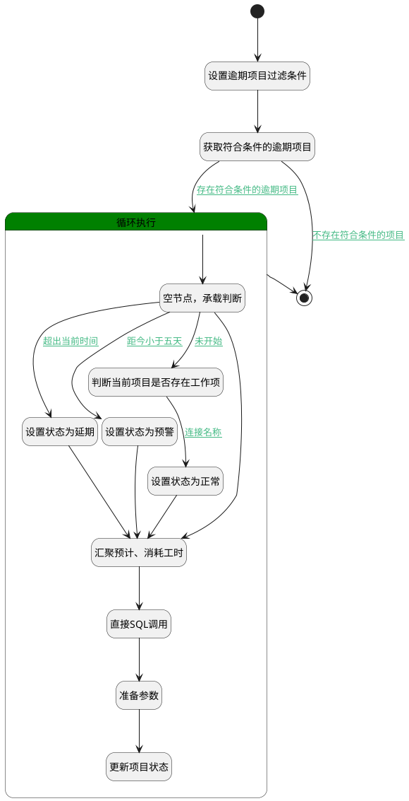

## 项目自动变更状态 <!-- {docsify-ignore-all} -->

   定时执行，当项目的结束时间小于当前日期时，自动将项目状态变更为延期；
当项目的结束时间距今不足五天时，自动将项目状态变更为预警；

### 处理过程




### 处理步骤说明

#### 开始 :id=Begin<sup class="footnote-symbol"> <font color=gray size=1>[开始]</font></sup>


*- N/A*
#### 设置逾期项目过滤条件 :id=PREPAREPARAM1<sup class="footnote-symbol"> <font color=gray size=1>[准备参数]</font></sup>


1. 将`0` 设置给  `project_filter(项目过滤器).N_IS_DELETED_EQ`
2. 将`Default(传入变量).ID(标识)` 设置给  `project_filter(项目过滤器).N_ID_EQ`
3. 将`0` 设置给  `project_filter(项目过滤器).N_IS_ARCHIVED_EQ`
4. 将`completed` 设置给  `project_filter(项目过滤器).N_STATE_TYPE_NOTEQ`
5. 将`1000` 设置给  `project_filter(项目过滤器).size`

#### 获取符合条件的逾期项目 :id=DEDATASET1<sup class="footnote-symbol"> <font color=gray size=1>[实体数据集]</font></sup>


调用实体 [项目(PROJECT)](module/ProjMgmt/project.md) 数据集合 [数据集(DEFAULT)](module/ProjMgmt/project#数据集合) ，查询参数为`project_filter(项目过滤器)`

将执行结果返回给参数`projects(项目集合)`

#### 结束 :id=END2<sup class="footnote-symbol"> <font color=gray size=1>[结束]</font></sup>


*- N/A*

#### 循环执行 :id=LOOPSUBCALL1<sup class="footnote-symbol"> <font color=gray size=1>[循环子调用]</font></sup>


循环参数`projects(项目集合)`，子循环参数使用`project_temp(循环项目)`
#### 空节点，承载判断 :id=PREPAREPARAM3<sup class="footnote-symbol"> <font color=gray size=1>[准备参数]</font></sup>


    无

#### 判断当前项目是否存在工作项 :id=RAWSQLCALL1<sup class="footnote-symbol"> <font color=gray size=1>[直接SQL调用]</font></sup>


<p class="panel-title"><b>执行sql语句</b></p>

```sql
SELECT count(1) as work_item_data FROM work_item WHERE PROJECT_ID = ?
```

<p class="panel-title"><b>执行sql参数</b></p>

1. `Default(传入变量).ID(标识)`

重置参数`has_child_data(存在子数据)`，并将执行sql结果赋值给参数`has_child_data(存在子数据)`

#### 设置状态为延期 :id=PREPAREPARAM2<sup class="footnote-symbol"> <font color=gray size=1>[准备参数]</font></sup>


1. 将`delay` 设置给  `project_temp(循环项目).STATE(项目状态)`

#### 设置状态为预警 :id=PREPAREPARAM4<sup class="footnote-symbol"> <font color=gray size=1>[准备参数]</font></sup>


1. 将`warning` 设置给  `project_temp(循环项目).STATE(项目状态)`

#### 汇聚预计、消耗工时 :id=RAWSQLCALL2<sup class="footnote-symbol"> <font color=gray size=1>[直接SQL调用]</font></sup>


<p class="panel-title"><b>执行sql语句</b></p>

```sql
SELECT
    SUM(CASE WHEN es.name = 'estimated_workload' THEN es.DECIMAL_VALUE ELSE 0 END) AS estimated_workload,
    SUM(CASE WHEN es.name = 'actual_workload' THEN es.DECIMAL_VALUE ELSE 0 END) AS actual_workload
FROM
    project p
JOIN
    work_item wi ON p.id = wi.project_id
JOIN
    extend_storage es ON wi.id = es.owner_id
WHERE
    p.id = ?
    AND es.owner_type = 'work_item'
    AND (es.name = 'estimated_workload' OR es.name = 'actual_workload')
    AND wi.pid is null;
```

<p class="panel-title"><b>执行sql参数</b></p>

1. `project_temp(循环项目).ID(标识)`

重置参数`select_result(查询结果)`，并将执行sql结果赋值给参数`select_result(查询结果)`

#### 设置状态为正常 :id=PREPAREPARAM5<sup class="footnote-symbol"> <font color=gray size=1>[准备参数]</font></sup>


1. 将`normal` 设置给  `project_temp(循环项目).STATE(项目状态)`

#### 直接SQL调用 :id=RAWSQLCALL3<sup class="footnote-symbol"> <font color=gray size=1>[直接SQL调用]</font></sup>


<p class="panel-title"><b>执行sql语句</b></p>

```sql
SELECT
    MIN(wi.ACTUAL_START_AT) AS ACTUAL_START_AT
FROM
    project p
JOIN
    work_item wi ON p.id = wi.project_id
WHERE
    p.id = ?

```

<p class="panel-title"><b>执行sql参数</b></p>

1. `project_temp(循环项目).ID(标识)`

重置参数`select_result(查询结果)`，并将执行sql结果赋值给参数`select_result(查询结果)`

#### 准备参数 :id=PREPAREPARAM6<sup class="footnote-symbol"> <font color=gray size=1>[准备参数]</font></sup>


1. 将`select_result(查询结果).estimated_workload` 设置给  `project_temp(循环项目).EXPECTED_TIME(预计工时)`
2. 将`select_result(查询结果).actual_workload` 设置给  `project_temp(循环项目).CONSUME_TIME(消耗工时)`
3. 将`select_result(查询结果).ACTUAL_START_AT(实际开始时间)` 设置给  `project_temp(循环项目).ACTUAL_START_AT(实际开始时间)`

#### 更新项目状态 :id=DEACTION1<sup class="footnote-symbol"> <font color=gray size=1>[实体行为]</font></sup>


调用实体 [项目(PROJECT)](module/ProjMgmt/project.md) 行为 [Update](module/ProjMgmt/project#行为) ，行为参数为`project_temp(循环项目)`


### 连接条件说明
#### 存在符合条件的逾期项目 :id=DEDATASET1-LOOPSUBCALL1

`projects(项目集合).size` GT `0`
#### 超出当前时间 :id=PREPAREPARAM3-PREPAREPARAM2

`project_temp(循环项目).END_AT(结束时间)` LT `当前时间` AND `project_temp(循环项目).state(项目状态)` NOTEQ `pending`
#### 距今小于五天 :id=PREPAREPARAM3-PREPAREPARAM4

`project_temp(循环项目).END_AT(结束时间)` GT `当前时间` AND `project_temp(循环项目).state(项目状态)` NOTEQ `pending`
#### 未开始 :id=PREPAREPARAM3-RAWSQLCALL1

`project_temp(循环项目).STATE(项目状态)` EQ `pending`
#### 连接名称 :id=RAWSQLCALL1-PREPAREPARAM5

`has_child_data(存在子数据).work_item_data` GT `0`
#### 不存在符合条件的项目 :id=DEDATASET1-END2

`projects(项目集合).size` EQ `0`


### 实体逻辑参数

|    中文名   |    代码名    |  数据类型    |  实体   |备注 |
| --------| --------| -------- | -------- | --------   |
|传入变量(<i class="fa fa-check"/></i>)|Default|数据对象|[项目(PROJECT)](module/ProjMgmt/project.md)||
|存在子数据|has_child_data|数据对象|||
|项目过滤器|project_filter|过滤器|||
|循环项目|project_temp|数据对象|[项目(PROJECT)](module/ProjMgmt/project.md)||
|项目集合|projects|分页查询|||
|查询结果|select_result|数据对象|[项目(PROJECT)](module/ProjMgmt/project.md)||
