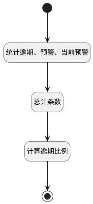

## 逾期工作项计数 <!-- {docsify-ignore-all} -->

   

### 处理过程




### 处理步骤说明

#### 开始 :id=Begin<sup class="footnote-symbol"> <font color=gray size=1>[开始]</font></sup>


*- N/A*
#### 统计逾期、预警、当前预警 :id=RAWSQLCALL1<sup class="footnote-symbol"> <font color=gray size=1>[直接SQL调用]</font></sup>


<p class="panel-title"><b>执行sql语句</b></p>

```sql
SELECT
    COUNT(CASE WHEN t1.IS_DELETED = 0
                AND t1.IS_ARCHIVED = 0
                AND (IFNULL((TIMESTAMPDIFF(DAY, t1.`END_AT`, IFNULL(t1.`ACTUAL_END_AT`, CURDATE()))), NULL) IS NOT NULL)
                AND t1.project_id =?
                AND TIMESTAMPDIFF(DAY, t1.`END_AT`, IFNULL(t1.`ACTUAL_END_AT`, CURDATE())) BETWEEN -3 AND -1
                AND t1.state = w.id
                AND w.type <> 'completed'
            THEN 1 END) AS upcoming_warning_count,
    COUNT(CASE WHEN t1.IS_DELETED = 0
                AND t1.IS_ARCHIVED = 0
                AND (IFNULL((TIMESTAMPDIFF(DAY, t1.`END_AT`, IFNULL(t1.`ACTUAL_END_AT`, CURDATE()))), NULL) IS NOT NULL)
                AND t1.project_id =?
                AND TIMESTAMPDIFF(DAY, t1.`END_AT`, IFNULL(t1.`ACTUAL_END_AT`, CURDATE())) = 0
                AND t1.state = w.id
                AND w.type <> 'completed'
            THEN 1 END) AS daily_warning_count,
    COUNT(CASE WHEN t1.IS_DELETED = 0
                AND t1.IS_ARCHIVED = 0
                AND (IFNULL((TIMESTAMPDIFF(DAY, t1.`END_AT`, IFNULL(t1.`ACTUAL_END_AT`, CURDATE()))), NULL) IS NOT NULL)
                AND t1.project_id =?
                AND TIMESTAMPDIFF(DAY, t1.`END_AT`, IFNULL(t1.`ACTUAL_END_AT`, CURDATE())) > 0
                AND t1.state = w.id
                AND w.type <> 'completed'
            THEN 1 END) AS overdue_count
FROM
    `WORK_ITEM` t1
JOIN
    `work_item_state` w ON t1.state = w.id;
```

<p class="panel-title"><b>执行sql参数</b></p>

1. `Default(传入变量).ID(标识)`
2. `Default(传入变量).ID(标识)`
3. `Default(传入变量).ID(标识)`

重置参数`result(结果)`，并将执行sql结果赋值给参数`result(结果)`

#### 总计条数 :id=RAWSQLCALL2<sup class="footnote-symbol"> <font color=gray size=1>[直接SQL调用]</font></sup>


<p class="panel-title"><b>执行sql语句</b></p>

```sql
SELECT
    COUNT(1) AS total_work_item_count
FROM
    work_item w 
    LEFT JOIN project p on w.PROJECT_ID = p.ID
    LEFT JOIN work_item_state s on s.ID = w.state
WHERE
    W.IS_DELETED = 0
    AND W.IS_ARCHIVED = 0
    AND s.type <> 'completed'
    AND p.ID = ?;
```

<p class="panel-title"><b>执行sql参数</b></p>

1. `Default(传入变量).ID(标识)`

重置参数`result(结果)`，并将执行sql结果赋值给参数`result(结果)`

#### 结束 :id=END1<sup class="footnote-symbol"> <font color=gray size=1>[结束]</font></sup>


返回 `result(结果)`

#### 计算逾期比例 :id=RAWSFCODE1<sup class="footnote-symbol"> <font color=gray size=1>[直接后台代码]</font></sup>


<p class="panel-title"><b>执行代码[JavaScript]</b></p>

```javascript
var result = logic.getParam("result");
var totalWorkItemCount = result.get("total_work_item_count");
var daily_warning_count = result.get("daily_warning_count");
var upcoming_warning_count = result.get("upcoming_warning_count");
var overdueCount = result.get("overdue_count");
var overdue_ratio = 0;
if (typeof overdueCount === "undefined" && daily_warning_count === "undefined" && upcoming_warning_count === "undefined" || overdueCount === null || daily_warning_count === null || upcoming_warning_count === null) {
    overdue_ratio = 0;
} else if (overdueCount === 0 && daily_warning_count === 0 && upcoming_warning_count === 0) {
    overdue_ratio = 0;
} else {
    overdue_ratio = ((overdueCount + daily_warning_count + upcoming_warning_count) / totalWorkItemCount) * 100;
    overdue_ratio = Math.round(overdue_ratio * 100) / 100;

}
if(overdue_ratio){
    result.set("overdue_ratio", Math.round(overdue_ratio) + "%");
}else{
    result.set("overdue_ratio", "0%");
}

```


### 实体逻辑参数

|    中文名   |    代码名    |  数据类型    |  实体   |备注 |
| --------| --------| -------- | -------- | --------   |
|传入变量(<i class="fa fa-check"/></i>)|Default|数据对象|[项目(PROJECT)](module/ProjMgmt/project.md)||
|结果|result|数据对象|[项目(PROJECT)](module/ProjMgmt/project.md)||
|工作项过滤器|work_item_filter|过滤器|||
|工作项分页结果|work_item_page|分页查询|||
