## 图表全屏（移动端） <!-- {docsify-ignore-all} -->

   

### 处理过程

```plantuml
@startuml
hide footbox
<style>
root {
  HyperlinkColor #42b983
}
</style>

hide empty description
state "开始" as Begin <<start>> [[$./mob_full_screen#begin {开始}]]
state "注入脚本代码" as RAWJSCODE1  [[$./mob_full_screen#rawjscode1 {注入脚本代码}]]


Begin --> RAWJSCODE1


@enduml
```




### 处理步骤说明

#### 开始 :id=Begin<sup class="footnote-symbol"> <font color=gray size=1>[开始]</font></sup>


#### 注入脚本代码 :id=RAWJSCODE1<sup class="footnote-symbol"> <font color=gray size=1>[直接前台代码]</font></sup>


<p class="panel-title"><b>执行代码</b></p>

```javascript
console.log('执行全屏逻辑');
if (uiLogic.ctrl) {
   const contentElement = uiLogic.ctrl.contentElement;
    if (contentElement) {
        ibiz.fullscreenUtil.openElementFullscreen(contentElement,{srftitle:'测试标题',showClose:true});
    }
}
```


### 实体逻辑参数

|    中文名   |    代码名    |  数据类型      |备注 |
| --------| --------| --------  | --------   |
|当前部件|ctrl|当前部件对象||
|传入变量(<i class="fa fa-check"/></i>)|Default|数据对象||
