## 设置默认项目成员（移动端） <!-- {docsify-ignore-all} -->

   新建项目时，默认将创建人添加到此项目成员

### 处理过程

```plantuml
@startuml
hide footbox
<style>
root {
  HyperlinkColor #42b983
}
</style>

hide empty description
state "开始" as Begin <<start>> [[$./mob_set_default_project_member#begin {开始}]]
state "结束" as END1 <<end>> [[$./mob_set_default_project_member#end1 {结束}]]
state "准备当前人数据" as PREPAREJSPARAM1  [[$./mob_set_default_project_member#preparejsparam1 {准备当前人数据}]]
state "绑定当前人" as RAWJSCODE1  [[$./mob_set_default_project_member#rawjscode1 {绑定当前人}]]


Begin --> PREPAREJSPARAM1
PREPAREJSPARAM1 --> RAWJSCODE1
RAWJSCODE1 --> END1


@enduml
```




### 处理步骤说明

#### 开始 :id=Begin<sup class="footnote-symbol"> <font color=gray size=1>[开始]</font></sup>


#### 结束 :id=END1<sup class="footnote-symbol"> <font color=gray size=1>[结束]</font></sup>


#### 准备当前人数据 :id=PREPAREJSPARAM1<sup class="footnote-symbol"> <font color=gray size=1>[准备参数]</font></sup>


1. 将`数据上下文[srfuserid] ==> members[user_id]` 设置给  `members(项目成员).user_id`
2. 将`数据上下文[srfusername] ==> members[name]` 设置给  `members(项目成员).name`

#### 绑定当前人 :id=RAWJSCODE1<sup class="footnote-symbol"> <font color=gray size=1>[直接前台代码]</font></sup>


<p class="panel-title"><b>执行代码</b></p>

```javascript
uiLogic.form.state.data.members = [uiLogic.members];
```


### 实体逻辑参数

|    中文名   |    代码名    |  数据类型      |备注 |
| --------| --------| --------  | --------   |
|传入变量(<i class="fa fa-check"/></i>)|Default|数据对象||
|表单|form|当前部件对象||
|项目成员|members|数据对象||
|关注数据|attention|数据对象||
