## 根据类型跳转项目主视图 <!-- {docsify-ignore-all} -->

   判断类型跳转不同的项目主视图

### 处理过程

```plantuml
@startuml
hide footbox
<style>
root {
  HyperlinkColor #42b983
}
</style>

hide empty description
state "开始" as Begin <<start>> [[$./open_project_main_view#begin {开始}]]
state "打开SCRUM主视图" as DEUIACTION1  [[$./open_project_main_view#deuiaction1 {打开SCRUM主视图}]]
state "打开waterfall主视图" as DEUIACTION3  [[$./open_project_main_view#deuiaction3 {打开waterfall主视图}]]
state "打开kanban视图" as DEUIACTION2  [[$./open_project_main_view#deuiaction2 {打开kanban视图}]]


Begin --> DEUIACTION1 : [[$./open_project_main_view#begin-deuiaction1{敏捷项目} 敏捷项目]]
Begin --> DEUIACTION2 : [[$./open_project_main_view#begin-deuiaction2{看板项目} 看板项目]]
Begin --> DEUIACTION3 : [[$./open_project_main_view#begin-deuiaction3{瀑布项目} 瀑布项目]]


@enduml
```




### 处理步骤说明

#### 开始 :id=Begin<sup class="footnote-symbol"> <font color=gray size=1>[开始]</font></sup>


#### 打开SCRUM主视图 :id=DEUIACTION1<sup class="footnote-symbol"> <font color=gray size=1>[实体界面行为调用]</font></sup>


调用实体 [项目(PROJECT)](module/ProjMgmt/project.md) 界面行为 [打开项目主视图（scrum）](module/ProjMgmt/project#界面行为) ，行为参数为`Default(传入变量)`

#### 打开kanban视图 :id=DEUIACTION2<sup class="footnote-symbol"> <font color=gray size=1>[实体界面行为调用]</font></sup>


调用实体 [项目(PROJECT)](module/ProjMgmt/project.md) 界面行为 [打开项目主视图（kanban）](module/ProjMgmt/project#界面行为) ，行为参数为`Default(传入变量)`

#### 打开waterfall主视图 :id=DEUIACTION3<sup class="footnote-symbol"> <font color=gray size=1>[实体界面行为调用]</font></sup>


调用实体 [项目(PROJECT)](module/ProjMgmt/project.md) 界面行为 [打开项目主视图（waterfall）](module/ProjMgmt/project#界面行为) ，行为参数为`Default(传入变量)`

### 连接条件说明
#### 敏捷项目 :id=Begin-DEUIACTION1

```Default(传入变量).type``` EQ ```scrum```
#### 看板项目 :id=Begin-DEUIACTION2

```Default(传入变量).type``` EQ ```kanban```
#### 瀑布项目 :id=Begin-DEUIACTION3

```Default(传入变量).type``` EQ ```waterfall```


### 实体逻辑参数

|    中文名   |    代码名    |  数据类型      |备注 |
| --------| --------| --------  | --------   |
|传入变量(<i class="fa fa-check"/></i>)|Default|数据对象||
|getobj|getobj|数据对象||
