## 刷新当前表格 <!-- {docsify-ignore-all} -->

   刷新当前视图的表格

### 处理过程

```plantuml
@startuml
hide footbox
<style>
root {
  HyperlinkColor #42b983
}
</style>

hide empty description
state "开始" as Begin <<start>> [[$./refresh_current_grid#begin {开始}]]
state "刷新视图" as RAWJSCODE1  [[$./refresh_current_grid#rawjscode1 {刷新视图}]]
state "视图部件调用" as VIEWCTRLINVOKE1  [[$./refresh_current_grid#viewctrlinvoke1 {视图部件调用}]]


Begin --> VIEWCTRLINVOKE1 : [[$./refresh_current_grid#begin-viewctrlinvoke1{刷新表格} 刷新表格]]
Begin --> RAWJSCODE1 : [[$./refresh_current_grid#begin-rawjscode1{刷新视图} 刷新视图]]


@enduml
```




### 处理步骤说明

#### 开始 :id=Begin<sup class="footnote-symbol"> <font color=gray size=1>[开始]</font></sup>


#### 刷新视图 :id=RAWJSCODE1<sup class="footnote-symbol"> <font color=gray size=1>[直接前台代码]</font></sup>


<p class="panel-title"><b>执行代码</b></p>

```javascript
view.call('Refresh');
setTimeout(() => {
    if (view.layoutPanel.panelItems.nav_pos && view.layoutPanel.panelItems.nav_pos.curNavViewMsg) {
        // 找到当前的右侧视图
        const viewId = view.layoutPanel.panelItems.nav_pos.curNavViewMsg.viewId;
        if (viewId) {
            const key = viewId.split('.').pop();
            const viewPos = view.getController(key);
            if (viewPos) {
                viewPos.call('Refresh');
            }
        }
    }
}, 300)
```

#### 视图部件调用 :id=VIEWCTRLINVOKE1<sup class="footnote-symbol"> <font color=gray size=1>[视图部件调用]</font></sup>


调用`grid(当前表格)`的方法`refresh`，参数为`Default(传入变量)`
### 连接条件说明
#### 刷新表格 :id=Begin-VIEWCTRLINVOKE1

```grid(当前表格)``` ISNOTNULL
#### 刷新视图 :id=Begin-RAWJSCODE1

```grid(当前表格)``` ISNULL


### 实体逻辑参数

|    中文名   |    代码名    |  数据类型      |备注 |
| --------| --------| --------  | --------   |
|当前工具栏|view|当前视图对象||
|当前表格|grid|部件对象||
|传入变量(<i class="fa fa-check"/></i>)|Default|数据对象||
