## 刷新项目状态 <!-- {docsify-ignore-all} -->

   

### 处理过程

```plantuml
@startuml
hide footbox
<style>
root {
  HyperlinkColor #42b983
}
</style>

hide empty description
state "开始" as Begin <<start>> [[$./refresh_project_state#begin {开始}]]
state "结束" as END1 <<end>> [[$./refresh_project_state#end1 {结束}]]
state "实体行为" as DEACTION1  [[$./refresh_project_state#deaction1 {实体行为}]]


Begin --> DEACTION1
DEACTION1 --> END1


@enduml
```

### 处理步骤说明

#### 开始 :id=Begin [开始]

#### 实体行为 :id=DEACTION1 [实体行为]

调用实体 [项目(PROJECT)](module/ProjMgmt/project.md) 行为 [刷新项目状态(project_automatic_change_state)](module/ProjMgmt/project#行为) ，行为参数为`Default(传入变量)`

#### 结束 :id=END1 [结束]

### 实体逻辑参数

|    中文名   |    代码名    |  数据类型      |备注 |
| --------| --------| --------  | --------   |
|传入变量(<i class="fa fa-check"/></i>)|Default|数据对象||
