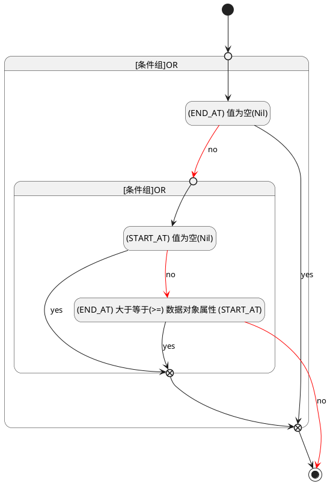

## 结束时间(END_AT) <!-- {docsify-ignore-all} -->

   

### 结束时间 :id=END_AT

#### 条件说明

##### (END_AT) 大于等于(>=) 数据对象属性 (START_AT) :id=a82aec4875b7f68d03f18a352fa3c2353

`END_AT(结束时间)` GTANDEQ  `START_AT`

> [!ATTENTION|label:规则信息|icon:fa fa-warning]
> 结束时间必须大于等于开始时间

##### (START_AT) 值为空(Nil) :id=a2b6bef0a4821690d96696b4142ed1603

`START_AT(开始时间)` ISNULL 

##### (END_AT) 值为空(Nil) :id=ada8e02e894b4c2db0bd54b72ae26d62e

`END_AT(结束时间)` ISNULL 

