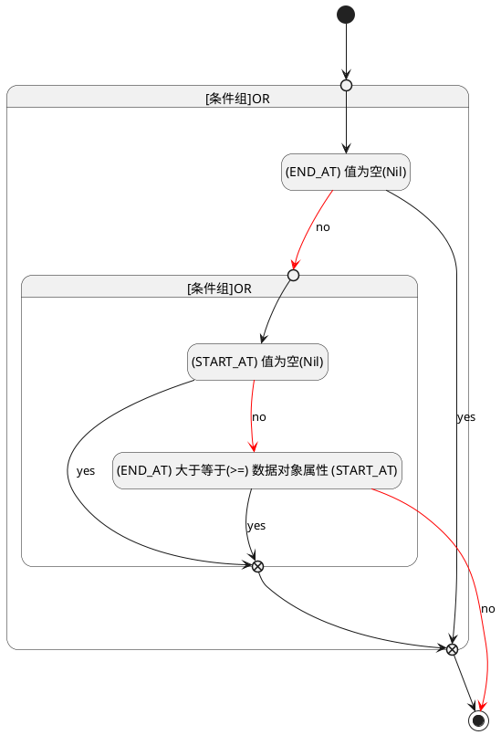

## 结束时间(END_AT) <!-- {docsify-ignore-all} -->

   

### 结束时间 :id=END_AT

#### 条件说明

##### (END_AT) 大于等于(>=) 数据对象属性 (START_AT) :id=a8c5f0c70ca97cb5191c655a16bc8f0a7

`END_AT(结束时间)` GTANDEQ  `START_AT`

> [!ATTENTION|label:规则信息|icon:fa fa-warning]
> 结束时间必须大于等于开始时间

##### (END_AT) 值为空(Nil) :id=a38aa5e8f192887d1182f130701c46675

`END_AT(结束时间)` ISNULL 

##### (START_AT) 值为空(Nil) :id=acea6c3b6e30a943d1fc99b7c9f777949

`START_AT(开始时间)` ISNULL 

