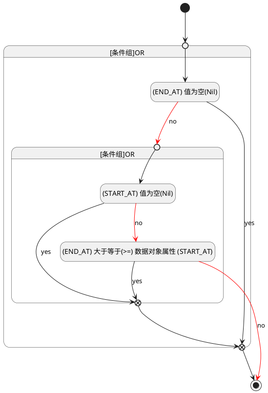

## 结束时间(END_AT) <!-- {docsify-ignore-all} -->

   

### 结束时间 :id=END_AT

```plantuml
@startuml
hide empty description
<style>
root {
  HyperlinkColor #42b983
}
</style>

state "start" as start  <<start>>
state "end" as end <<end>>
state "[条件组]OR" as aee6be40ea2c58684cd033303aab67dc [[$./end_at#aaee6be40ea2c58684cd033303aab67dc {"[条件组]OR"}]] {
state " " as aee6be40ea2c58684cd033303aab67dc_entry  <<entryPoint>>
state "(END_AT) 值为空(Nil)" as 2e0e1a38e58013075e2efcfa42e0452d [[$./end_at#a2e0e1a38e58013075e2efcfa42e0452d {"[常规条件] 值为空(Nil)"}]]
state "[条件组]OR" as 36591e33f6f64981352d0625fdbf88f8 [[$./end_at#a36591e33f6f64981352d0625fdbf88f8 {"[条件组]OR"}]] {
state " " as 36591e33f6f64981352d0625fdbf88f8_entry  <<entryPoint>>
state "(START_AT) 值为空(Nil)" as 6171f92ef42e99cbf1169d1a76b4c238 [[$./end_at#a6171f92ef42e99cbf1169d1a76b4c238 {"[常规条件] 值为空(Nil)"}]]
state "(END_AT) 大于等于(>=) 数据对象属性 (START_AT)" as adabd41ce729d5842f5e8ba50bf4b878 [[$./end_at#aadabd41ce729d5842f5e8ba50bf4b878 {"[常规条件] 大于等于(>=) 数据对象属性 (START_AT)"}]]
state " " as 36591e33f6f64981352d0625fdbf88f8_exit  <<exitPoint>>
}
state " " as aee6be40ea2c58684cd033303aab67dc_exit  <<exitPoint>>
}


start --> aee6be40ea2c58684cd033303aab67dc_entry 
aee6be40ea2c58684cd033303aab67dc_entry --> 2e0e1a38e58013075e2efcfa42e0452d 
2e0e1a38e58013075e2efcfa42e0452d --> aee6be40ea2c58684cd033303aab67dc_exit  : yes
2e0e1a38e58013075e2efcfa42e0452d -[#red]-> 36591e33f6f64981352d0625fdbf88f8_entry  : no

36591e33f6f64981352d0625fdbf88f8_entry --> 6171f92ef42e99cbf1169d1a76b4c238 
6171f92ef42e99cbf1169d1a76b4c238 --> 36591e33f6f64981352d0625fdbf88f8_exit  : yes
6171f92ef42e99cbf1169d1a76b4c238 -[#red]-> adabd41ce729d5842f5e8ba50bf4b878  : no

adabd41ce729d5842f5e8ba50bf4b878 --> 36591e33f6f64981352d0625fdbf88f8_exit  : yes
adabd41ce729d5842f5e8ba50bf4b878 -[#red]-> end  : no
36591e33f6f64981352d0625fdbf88f8_exit --> aee6be40ea2c58684cd033303aab67dc_exit 
aee6be40ea2c58684cd033303aab67dc_exit --> end 


@enduml
```

#### 条件说明

##### (START_AT) 值为空(Nil) :id=a6171f92ef42e99cbf1169d1a76b4c238

`START_AT(开始时间)` ISNULL 

##### (END_AT) 大于等于(>=) 数据对象属性 (START_AT) :id=aadabd41ce729d5842f5e8ba50bf4b878

`END_AT(结束时间)` GTANDEQ  `START_AT`

> [!ATTENTION|label:规则信息|icon:fa fa-warning]
> 结束时间必须大于等于开始时间

##### (END_AT) 值为空(Nil) :id=a2e0e1a38e58013075e2efcfa42e0452d

`END_AT(结束时间)` ISNULL 

