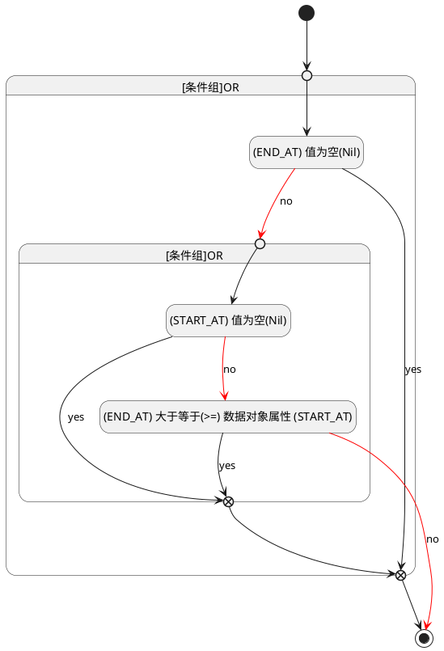

## 结束时间(END_AT) <!-- {docsify-ignore-all} -->

   

### 结束时间 :id=END_AT

```plantuml
@startuml
hide empty description
<style>
root {
  HyperlinkColor #42b983
}
</style>

state "start" as start  <<start>>
state "end" as end <<end>>
state "[条件组]OR" as 678cfb253eeb953a704cb93247b6de63 [[$./end_at#a678cfb253eeb953a704cb93247b6de63 {"[条件组]OR"}]] {
state " " as 678cfb253eeb953a704cb93247b6de63_entry  <<entryPoint>>
state "(END_AT) 值为空(Nil)" as bb84e2f6950178f432f833f7fa99691b [[$./end_at#abb84e2f6950178f432f833f7fa99691b {"[常规条件] 值为空(Nil)"}]]
state "[条件组]OR" as a0bed75b3c0f8ea8a185af93ac93702f [[$./end_at#aa0bed75b3c0f8ea8a185af93ac93702f {"[条件组]OR"}]] {
state " " as a0bed75b3c0f8ea8a185af93ac93702f_entry  <<entryPoint>>
state "(START_AT) 值为空(Nil)" as 125b27936b09ad0e524e977004c61e38 [[$./end_at#a125b27936b09ad0e524e977004c61e38 {"[常规条件] 值为空(Nil)"}]]
state "(END_AT) 大于等于(>=) 数据对象属性 (START_AT)" as a21102b392058c4b357723755c420f40 [[$./end_at#aa21102b392058c4b357723755c420f40 {"[常规条件] 大于等于(>=) 数据对象属性 (START_AT)"}]]
state " " as a0bed75b3c0f8ea8a185af93ac93702f_exit  <<exitPoint>>
}
state " " as 678cfb253eeb953a704cb93247b6de63_exit  <<exitPoint>>
}


start --> 678cfb253eeb953a704cb93247b6de63_entry 
678cfb253eeb953a704cb93247b6de63_entry --> bb84e2f6950178f432f833f7fa99691b 
bb84e2f6950178f432f833f7fa99691b --> 678cfb253eeb953a704cb93247b6de63_exit  : yes
bb84e2f6950178f432f833f7fa99691b -[#red]-> a0bed75b3c0f8ea8a185af93ac93702f_entry  : no

a0bed75b3c0f8ea8a185af93ac93702f_entry --> 125b27936b09ad0e524e977004c61e38 
125b27936b09ad0e524e977004c61e38 --> a0bed75b3c0f8ea8a185af93ac93702f_exit  : yes
125b27936b09ad0e524e977004c61e38 -[#red]-> a21102b392058c4b357723755c420f40  : no

a21102b392058c4b357723755c420f40 --> a0bed75b3c0f8ea8a185af93ac93702f_exit  : yes
a21102b392058c4b357723755c420f40 -[#red]-> end  : no
a0bed75b3c0f8ea8a185af93ac93702f_exit --> 678cfb253eeb953a704cb93247b6de63_exit 
678cfb253eeb953a704cb93247b6de63_exit --> end 


@enduml
```

#### 条件说明

##### (END_AT) 值为空(Nil) :id=abb84e2f6950178f432f833f7fa99691b

`END_AT(结束时间)` ISNULL 

##### (START_AT) 值为空(Nil) :id=a125b27936b09ad0e524e977004c61e38

`START_AT(开始时间)` ISNULL 

##### (END_AT) 大于等于(>=) 数据对象属性 (START_AT) :id=aa21102b392058c4b357723755c420f40

`END_AT(结束时间)` GTANDEQ  `START_AT`

> [!ATTENTION|label:规则信息|icon:fa fa-warning]
> 结束时间必须大于等于开始时间

