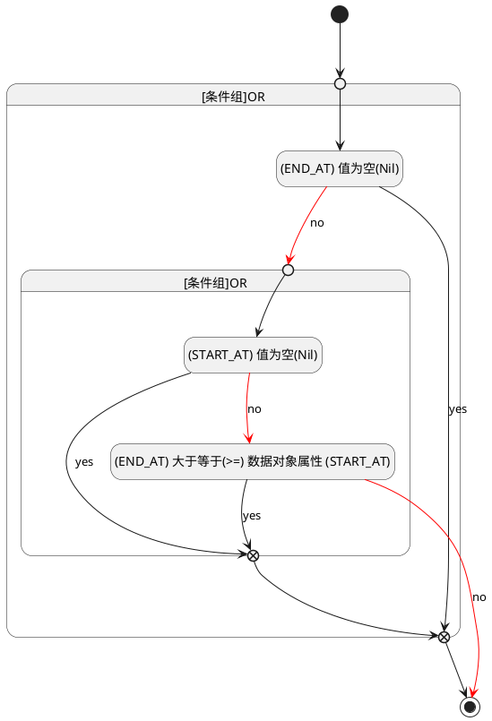

## 结束时间(END_AT) <!-- {docsify-ignore-all} -->

   

### 结束时间 :id=END_AT

```plantuml
@startuml
hide empty description
<style>
root {
  HyperlinkColor #42b983
}
</style>

state "start" as start  <<start>>
state "end" as end <<end>>
state "[条件组]OR" as 21307864b1e57170f808f11f36365dc6 [[$./end_at#a21307864b1e57170f808f11f36365dc6 {"[条件组]OR"}]] {
state " " as 21307864b1e57170f808f11f36365dc6_entry  <<entryPoint>>
state "(END_AT) 值为空(Nil)" as 45dde6ea1bed65e5d7c5f3869941b21c [[$./end_at#a45dde6ea1bed65e5d7c5f3869941b21c {"[常规条件] 值为空(Nil)"}]]
state "[条件组]OR" as a4de267f3efff553428c09753c3a028c [[$./end_at#aa4de267f3efff553428c09753c3a028c {"[条件组]OR"}]] {
state " " as a4de267f3efff553428c09753c3a028c_entry  <<entryPoint>>
state "(START_AT) 值为空(Nil)" as df140ed859b569bad516856da806dfdd [[$./end_at#adf140ed859b569bad516856da806dfdd {"[常规条件] 值为空(Nil)"}]]
state "(END_AT) 大于等于(>=) 数据对象属性 (START_AT)" as 7b11d1596a3fc5e4aa41b9fd404b2b94 [[$./end_at#a7b11d1596a3fc5e4aa41b9fd404b2b94 {"[常规条件] 大于等于(>=) 数据对象属性 (START_AT)"}]]
state " " as a4de267f3efff553428c09753c3a028c_exit  <<exitPoint>>
}
state " " as 21307864b1e57170f808f11f36365dc6_exit  <<exitPoint>>
}


start --> 21307864b1e57170f808f11f36365dc6_entry 
21307864b1e57170f808f11f36365dc6_entry --> 45dde6ea1bed65e5d7c5f3869941b21c 
45dde6ea1bed65e5d7c5f3869941b21c --> 21307864b1e57170f808f11f36365dc6_exit  : yes
45dde6ea1bed65e5d7c5f3869941b21c -[#red]-> a4de267f3efff553428c09753c3a028c_entry  : no

a4de267f3efff553428c09753c3a028c_entry --> df140ed859b569bad516856da806dfdd 
df140ed859b569bad516856da806dfdd --> a4de267f3efff553428c09753c3a028c_exit  : yes
df140ed859b569bad516856da806dfdd -[#red]-> 7b11d1596a3fc5e4aa41b9fd404b2b94  : no

7b11d1596a3fc5e4aa41b9fd404b2b94 --> a4de267f3efff553428c09753c3a028c_exit  : yes
7b11d1596a3fc5e4aa41b9fd404b2b94 -[#red]-> end  : no
a4de267f3efff553428c09753c3a028c_exit --> 21307864b1e57170f808f11f36365dc6_exit 
21307864b1e57170f808f11f36365dc6_exit --> end 


@enduml
```

#### 条件说明

##### (END_AT) 值为空(Nil) :id=a45dde6ea1bed65e5d7c5f3869941b21c

`END_AT(结束时间)` ISNULL 

##### (START_AT) 值为空(Nil) :id=adf140ed859b569bad516856da806dfdd

`START_AT(开始时间)` ISNULL 

##### (END_AT) 大于等于(>=) 数据对象属性 (START_AT) :id=a7b11d1596a3fc5e4aa41b9fd404b2b94

`END_AT(结束时间)` GTANDEQ  `START_AT`

> [!ATTENTION|label:规则信息|icon:fa fa-warning]
> 结束时间必须大于等于开始时间

