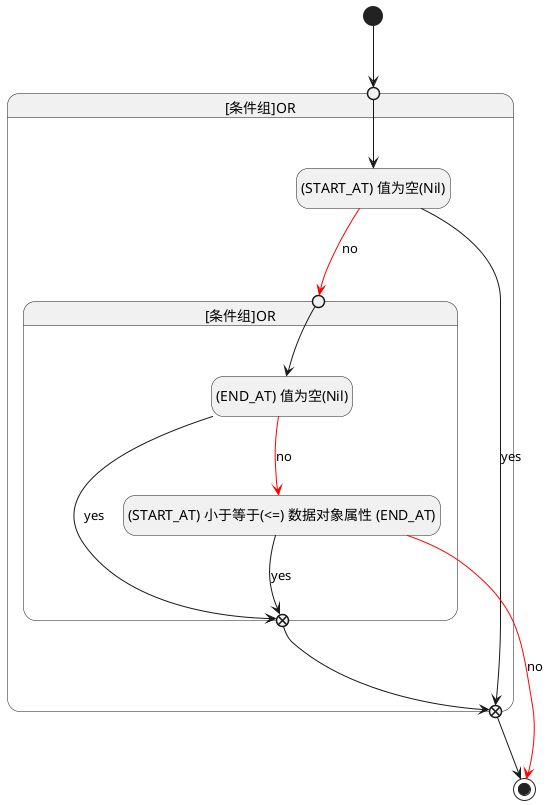

## 开始时间(START_AT) <!-- {docsify-ignore-all} -->

   

### 开始时间 :id=START_AT

#### 条件说明

##### (END_AT) 值为空(Nil) :id=a3dca7a19f674cd9244f983ecc790c1f7

`END_AT(结束时间)` ISNULL 

##### (START_AT) 值为空(Nil) :id=aea76d1c39a0ee66f8969197a5ed95f30

`START_AT(开始时间)` ISNULL 

##### (START_AT) 小于等于(<=) 数据对象属性 (END_AT) :id=a6a34d259fe777768be6a371dc9f79a22

`START_AT(开始时间)` LTANDEQ  `END_AT`

> [!ATTENTION|label:规则信息|icon:fa fa-warning]
> 开始时间必须小于等于结束时间

