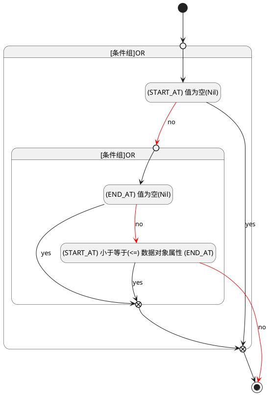

## 开始时间(START_AT) <!-- {docsify-ignore-all} -->

   

### 开始时间 :id=START_AT

#### 条件说明

##### (START_AT) 小于等于(<=) 数据对象属性 (END_AT) :id=a6cfeee9c5698a279dee2db046ae68d38

`START_AT(开始时间)` LTANDEQ  `END_AT`

> [!ATTENTION|label:规则信息|icon:fa fa-warning]
> 开始时间必须小于等于结束时间

##### (START_AT) 值为空(Nil) :id=a1cb4ec9d07d92df221b7ecd2ee466bf4

`START_AT(开始时间)` ISNULL 

##### (END_AT) 值为空(Nil) :id=a49dda5283e8cc6bd01ceadf0135bbf30

`END_AT(结束时间)` ISNULL 

