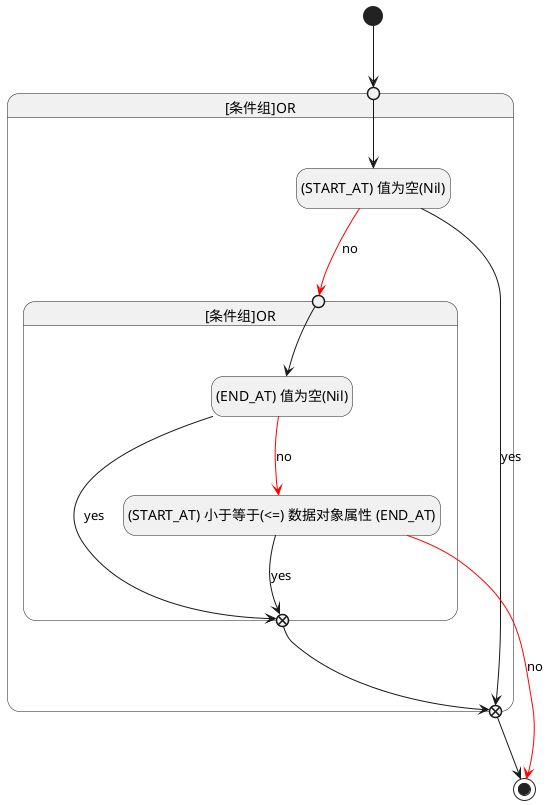

## 开始时间(START_AT) <!-- {docsify-ignore-all} -->

   

### 开始时间 :id=START_AT

#### 条件说明

##### (START_AT) 值为空(Nil) :id=a779ea7aa8f62e2ab79bd82d1115b4615

`START_AT(开始时间)` ISNULL 

##### (END_AT) 值为空(Nil) :id=aa1f8d905ba782393fd807520f044eedb

`END_AT(结束时间)` ISNULL 

##### (START_AT) 小于等于(<=) 数据对象属性 (END_AT) :id=a73bbda1adda9781c6e5866e7babd65e0

`START_AT(开始时间)` LTANDEQ  `END_AT`

> [!ATTENTION|label:规则信息|icon:fa fa-warning]
> 开始时间必须小于等于结束时间

