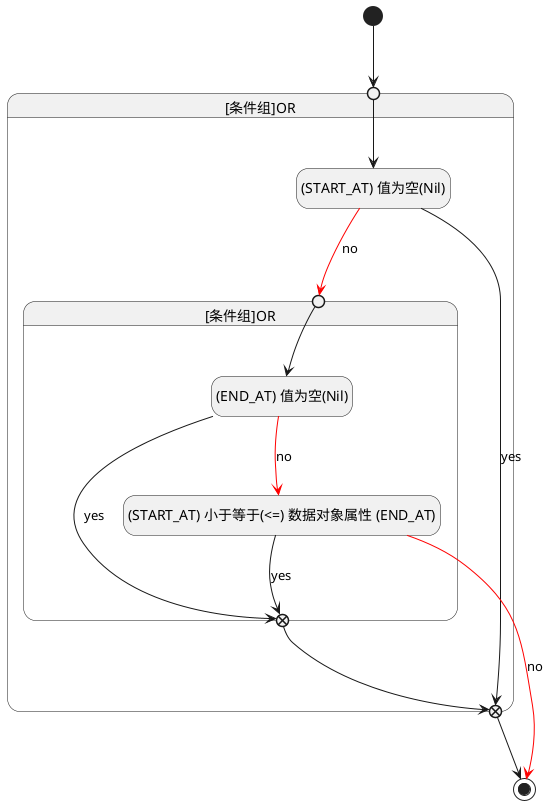

## 开始时间(START_AT) <!-- {docsify-ignore-all} -->

   

### 开始时间 :id=START_AT

```plantuml
@startuml
hide empty description
<style>
root {
  HyperlinkColor #42b983
}
</style>

state "start" as start  <<start>>
state "end" as end <<end>>
state "[条件组]OR" as 8511956b5c3bef4601d75a22a1a2d0fe [[$./start_at#a8511956b5c3bef4601d75a22a1a2d0fe {"[条件组]OR"}]] {
state " " as 8511956b5c3bef4601d75a22a1a2d0fe_entry  <<entryPoint>>
state "(START_AT) 值为空(Nil)" as 7de7f38a87bbca89bc23c1a7e739cc37 [[$./start_at#a7de7f38a87bbca89bc23c1a7e739cc37 {"[常规条件] 值为空(Nil)"}]]
state "[条件组]OR" as 606d2e96309256ff0d939ed737b05b42 [[$./start_at#a606d2e96309256ff0d939ed737b05b42 {"[条件组]OR"}]] {
state " " as 606d2e96309256ff0d939ed737b05b42_entry  <<entryPoint>>
state "(END_AT) 值为空(Nil)" as f614e843dd25359402aba34b358e7c6b [[$./start_at#af614e843dd25359402aba34b358e7c6b {"[常规条件] 值为空(Nil)"}]]
state "(START_AT) 小于等于(<=) 数据对象属性 (END_AT)" as 1f51782cab1450e017e42132fb788106 [[$./start_at#a1f51782cab1450e017e42132fb788106 {"[常规条件] 小于等于(<=) 数据对象属性 (END_AT)"}]]
state " " as 606d2e96309256ff0d939ed737b05b42_exit  <<exitPoint>>
}
state " " as 8511956b5c3bef4601d75a22a1a2d0fe_exit  <<exitPoint>>
}


start --> 8511956b5c3bef4601d75a22a1a2d0fe_entry 
8511956b5c3bef4601d75a22a1a2d0fe_entry --> 7de7f38a87bbca89bc23c1a7e739cc37 
7de7f38a87bbca89bc23c1a7e739cc37 --> 8511956b5c3bef4601d75a22a1a2d0fe_exit  : yes
7de7f38a87bbca89bc23c1a7e739cc37 -[#red]-> 606d2e96309256ff0d939ed737b05b42_entry  : no

606d2e96309256ff0d939ed737b05b42_entry --> f614e843dd25359402aba34b358e7c6b 
f614e843dd25359402aba34b358e7c6b --> 606d2e96309256ff0d939ed737b05b42_exit  : yes
f614e843dd25359402aba34b358e7c6b -[#red]-> 1f51782cab1450e017e42132fb788106  : no

1f51782cab1450e017e42132fb788106 --> 606d2e96309256ff0d939ed737b05b42_exit  : yes
1f51782cab1450e017e42132fb788106 -[#red]-> end  : no
606d2e96309256ff0d939ed737b05b42_exit --> 8511956b5c3bef4601d75a22a1a2d0fe_exit 
8511956b5c3bef4601d75a22a1a2d0fe_exit --> end 


@enduml
```

#### 条件说明

##### (START_AT) 小于等于(<=) 数据对象属性 (END_AT) :id=a1f51782cab1450e017e42132fb788106

`START_AT(开始时间)` LTANDEQ  `END_AT`

> [!ATTENTION|label:规则信息|icon:fa fa-warning]
> 开始时间必须小于等于结束时间

##### (END_AT) 值为空(Nil) :id=af614e843dd25359402aba34b358e7c6b

`END_AT(结束时间)` ISNULL 

##### (START_AT) 值为空(Nil) :id=a7de7f38a87bbca89bc23c1a7e739cc37

`START_AT(开始时间)` ISNULL 

