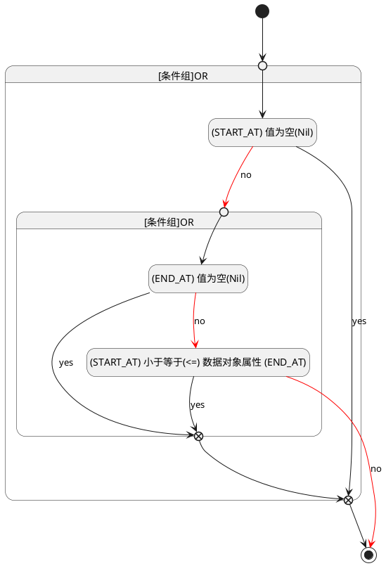

## 开始时间(START_AT) <!-- {docsify-ignore-all} -->

   

### 开始时间 :id=START_AT

```plantuml
@startuml
hide empty description
<style>
root {
  HyperlinkColor #42b983
}
</style>

state "start" as start  <<start>>
state "end" as end <<end>>
state "[条件组]OR" as f17c931c42ebb57f4fdf34f8201f548c [[$./start_at#af17c931c42ebb57f4fdf34f8201f548c {"[条件组]OR"}]] {
state " " as f17c931c42ebb57f4fdf34f8201f548c_entry  <<entryPoint>>
state "(START_AT) 值为空(Nil)" as cbce4c37d28b6f3a9d8db75364924b92 [[$./start_at#acbce4c37d28b6f3a9d8db75364924b92 {"[常规条件] 值为空(Nil)"}]]
state "[条件组]OR" as 086fe327a62ace0f1404f50d8ab43813 [[$./start_at#a086fe327a62ace0f1404f50d8ab43813 {"[条件组]OR"}]] {
state " " as 086fe327a62ace0f1404f50d8ab43813_entry  <<entryPoint>>
state "(END_AT) 值为空(Nil)" as e3c8d17453bca712fa59cffec9d72fe3 [[$./start_at#ae3c8d17453bca712fa59cffec9d72fe3 {"[常规条件] 值为空(Nil)"}]]
state "(START_AT) 小于等于(<=) 数据对象属性 (END_AT)" as 73e2b29b2ab809afcfd61f8ecd0cc7c5 [[$./start_at#a73e2b29b2ab809afcfd61f8ecd0cc7c5 {"[常规条件] 小于等于(<=) 数据对象属性 (END_AT)"}]]
state " " as 086fe327a62ace0f1404f50d8ab43813_exit  <<exitPoint>>
}
state " " as f17c931c42ebb57f4fdf34f8201f548c_exit  <<exitPoint>>
}


start --> f17c931c42ebb57f4fdf34f8201f548c_entry 
f17c931c42ebb57f4fdf34f8201f548c_entry --> cbce4c37d28b6f3a9d8db75364924b92 
cbce4c37d28b6f3a9d8db75364924b92 --> f17c931c42ebb57f4fdf34f8201f548c_exit  : yes
cbce4c37d28b6f3a9d8db75364924b92 -[#red]-> 086fe327a62ace0f1404f50d8ab43813_entry  : no

086fe327a62ace0f1404f50d8ab43813_entry --> e3c8d17453bca712fa59cffec9d72fe3 
e3c8d17453bca712fa59cffec9d72fe3 --> 086fe327a62ace0f1404f50d8ab43813_exit  : yes
e3c8d17453bca712fa59cffec9d72fe3 -[#red]-> 73e2b29b2ab809afcfd61f8ecd0cc7c5  : no

73e2b29b2ab809afcfd61f8ecd0cc7c5 --> 086fe327a62ace0f1404f50d8ab43813_exit  : yes
73e2b29b2ab809afcfd61f8ecd0cc7c5 -[#red]-> end  : no
086fe327a62ace0f1404f50d8ab43813_exit --> f17c931c42ebb57f4fdf34f8201f548c_exit 
f17c931c42ebb57f4fdf34f8201f548c_exit --> end 


@enduml
```

#### 条件说明

##### (START_AT) 值为空(Nil) :id=acbce4c37d28b6f3a9d8db75364924b92

`START_AT(开始时间)` ISNULL 

##### (END_AT) 值为空(Nil) :id=ae3c8d17453bca712fa59cffec9d72fe3

`END_AT(结束时间)` ISNULL 

##### (START_AT) 小于等于(<=) 数据对象属性 (END_AT) :id=a73e2b29b2ab809afcfd61f8ecd0cc7c5

`START_AT(开始时间)` LTANDEQ  `END_AT`

> [!ATTENTION|label:规则信息|icon:fa fa-warning]
> 开始时间必须小于等于结束时间

