## 移除项目成员通知 <!-- {docsify-ignore-all} -->

   移除项目成员时向对应用户发送通知消息

### 处理过程

```plantuml
@startuml
hide empty description
<style>
root {
  HyperlinkColor #42b983
}
</style>

hide empty description
state "开始" as Begin <<start>> [[$./remove_project_member_notify#begin {"开始"}]]
state "获取项目成员数据" as DEACTION1  [[$./remove_project_member_notify#deaction1 {"获取项目成员数据"}]]
state "填充当前操作人" as PREPAREPARAM1  [[$./remove_project_member_notify#prepareparam1 {"填充当前操作人"}]]
state "填充操作时间" as RAWSFCODE1  [[$./remove_project_member_notify#rawsfcode1 {"填充操作时间"}]]
state "移除成员通知" as DENOTIFY1  [[$./remove_project_member_notify#denotify1 {"移除成员通知"}]]
state "结束" as END1 <<end>> [[$./remove_project_member_notify#end1 {"结束"}]]


Begin --> DEACTION1
DEACTION1 --> PREPAREPARAM1
PREPAREPARAM1 --> RAWSFCODE1
RAWSFCODE1 --> DENOTIFY1
DENOTIFY1 --> END1


@enduml
```




### 处理步骤说明

#### 开始 :id=Begin<sup class="footnote-symbol"> <font color=gray size=1>[开始]</font></sup>


*- N/A*
#### 获取项目成员数据 :id=DEACTION1<sup class="footnote-symbol"> <font color=gray size=1>[实体行为]</font></sup>


调用实体 [项目成员(PROJECT_MEMBER)](module/ProjMgmt/project_member.md) 行为 [Get](module/ProjMgmt/project_member#行为) ，行为参数为`Default(传入变量)`

#### 填充当前操作人 :id=PREPAREPARAM1<sup class="footnote-symbol"> <font color=gray size=1>[准备参数]</font></sup>


1. 将`用户全局对象.srfpersonid` 设置给  `Default(传入变量).UPDATE_MAN(更新人)`

#### 填充操作时间 :id=RAWSFCODE1<sup class="footnote-symbol"> <font color=gray size=1>[直接后台代码]</font></sup>


<p class="panel-title"><b>执行代码[JavaScript]</b></p>

```javascript
var defaultObj = logic.getParam("default");
defaultObj.set("update_time", new Date());
```

#### 移除成员通知 :id=DENOTIFY1<sup class="footnote-symbol"> <font color=gray size=1>[实体通知]</font></sup>


调用实体 [项目成员(PROJECT_MEMBER)](module/ProjMgmt/project_member.md) 通知 [项目成员移除通知(remove_member_nofity)](module/ProjMgmt/project_member/notify/remove_member_nofity) ，参数为`Default(传入变量)`
#### 结束 :id=END1<sup class="footnote-symbol"> <font color=gray size=1>[结束]</font></sup>


*- N/A*


### 实体逻辑参数

|    中文名   |    代码名    |  数据类型    |  实体   |备注 |
| --------| --------| -------- | -------- | --------   |
|传入变量(<i class="fa fa-check"/></i>)|Default|数据对象|[项目成员(PROJECT_MEMBER)](module/ProjMgmt/project_member.md)||
