## 删除标签 <!-- {docsify-ignore-all} -->

   删除标签时对工作项的标签属性进行处理

### 处理过程

```plantuml
@startuml
hide empty description
<style>
root {
  HyperlinkColor #42b983
}
</style>

hide empty description
state "开始" as Begin <<start>> [[$./delete_tag#begin {"开始"}]]
state "结束" as END1 <<end>> [[$./delete_tag#end1 {"结束"}]]
state "更新标签属性" as RAWSQLCALL1  [[$./delete_tag#rawsqlcall1 {"更新标签属性"}]]
state "删除标签" as RAWSQLCALL2  [[$./delete_tag#rawsqlcall2 {"删除标签"}]]


Begin --> RAWSQLCALL1
RAWSQLCALL1 --> RAWSQLCALL2
RAWSQLCALL2 --> END1


@enduml
```




### 处理步骤说明

#### 开始 :id=Begin<sup class="footnote-symbol"> <font color=gray size=1>[开始]</font></sup>


*- N/A*
#### 结束 :id=END1<sup class="footnote-symbol"> <font color=gray size=1>[结束]</font></sup>


*- N/A*

#### 更新标签属性 :id=RAWSQLCALL1<sup class="footnote-symbol"> <font color=gray size=1>[直接SQL调用]</font></sup>


<p class="panel-title"><b>执行sql语句</b></p>

```sql
UPDATE work_item
SET tags = TRIM(BOTH ',' FROM REPLACE(CONCAT(',', tags, ','), CONCAT(',', ?, ','), ','))
WHERE FIND_IN_SET(?, tags) > 0 ;
```

<p class="panel-title"><b>执行sql参数</b></p>

1. `Default(传入变量).ID(标识)`
2. `Default(传入变量).ID(标识)`


#### 删除标签 :id=RAWSQLCALL2<sup class="footnote-symbol"> <font color=gray size=1>[直接SQL调用]</font></sup>


<p class="panel-title"><b>执行sql语句</b></p>

```sql
delete  from project_tag  where  id = ?
```

<p class="panel-title"><b>执行sql参数</b></p>

1. `Default(传入变量).ID(标识)`


### 实体逻辑参数

|    中文名   |    代码名    |  数据类型    |  实体   |备注 |
| --------| --------| -------- | -------- | --------   |
|传入变量(<i class="fa fa-check"/></i>)|Default|数据对象|[项目标签(PROJECT_TAG)](module/ProjMgmt/project_tag.md)||
|过滤器|filter|过滤器|||
|排期过滤器|plan_filter|过滤器|||
|排期计划分页数据|product_plan_pages|分页查询|||
