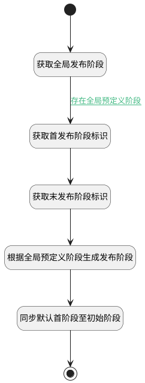

## 新建后附加逻辑 <!-- {docsify-ignore-all} -->

   根据全局定义的阶段，生成发布阶段

### 处理过程




### 处理步骤说明

#### 开始 :id=Begin<sup class="footnote-symbol"> <font color=gray size=1>[开始]</font></sup>


*- N/A*
#### 获取全局发布阶段 :id=DEDATASET1<sup class="footnote-symbol"> <font color=gray size=1>[实体数据集]</font></sup>


调用实体 [发布阶段(STAGE)](module/ProjMgmt/stage.md) 数据集合 [全局级发布阶段(system)](module/ProjMgmt/stage#数据集合) ，查询参数为`stage_filter(全局发布阶段查询过滤器)`

将执行结果返回给参数`stages(全局发布阶段)`

#### 获取首发布阶段标识 :id=RAWSQLCALL1<sup class="footnote-symbol"> <font color=gray size=1>[直接SQL调用]</font></sup>


<p class="panel-title"><b>执行sql语句</b></p>

```sql
select id as first_stage_id from stage 
where  RELEASE_ID is null
order by `SEQUENCE` asc limit 1

```

<p class="panel-title"><b>执行sql参数</b></p>

1. `Default(传入变量).ID(标识)`

重置参数`Default(传入变量)`，并将执行sql结果赋值给参数`Default(传入变量)`

#### 获取末发布阶段标识 :id=RAWSQLCALL2<sup class="footnote-symbol"> <font color=gray size=1>[直接SQL调用]</font></sup>


<p class="panel-title"><b>执行sql语句</b></p>

```sql
select id as last_stage_id from stage 
where  RELEASE_ID is null
order by `SEQUENCE` desc limit 1

```

<p class="panel-title"><b>执行sql参数</b></p>

1. `Default(传入变量).ID(标识)`

重置参数`Default(传入变量)`，并将执行sql结果赋值给参数`Default(传入变量)`

#### 根据全局预定义阶段生成发布阶段 :id=RAWSFCODE1<sup class="footnote-symbol"> <font color=gray size=1>[直接后台代码]</font></sup>


<p class="panel-title"><b>执行代码[Groovy]</b></p>

```groovy
def stages = logic.param('stages').getReal()
def _default = logic.param('Default').getReal()
def first_stage_id = _default.get('first_stage_id')
def last_stage_id = _default.get('last_stage_id')
//获取实体运行对象 参数实体名
def stage_runtime = sys.dataentity('stage')
def release_runtime = sys.dataentity('release')
stages.each { it ->
    //构造阶段对象
    def new_stage = stage_runtime.entity()
    new_stage.set('release_id', _default.get('id'))
    new_stage.set('pid', it.get('id'))
    new_stage.set('name', it.get('name'))
    new_stage.set('type', it.get('type'))
    new_stage.set('sequence', it.get('sequence'))
    new_stage.set('color', it.get('color'))
    new_stage.set('style', it.get('style'))
    new_stage.set('is_current', 0)
    if(it.get('id') == first_stage_id){
        new_stage.set('is_current', 1)
        new_stage.set('operated_time', _default.get('start_at'))
    }
    if(it.get('id') == last_stage_id){
        new_stage.set('operated_time', _default.get('end_at'))
    }
    //新建发布
    stage_runtime.create(new_stage)
}


```

#### 同步默认首阶段至初始阶段 :id=RAWSQLCALL3<sup class="footnote-symbol"> <font color=gray size=1>[直接SQL调用]</font></sup>


<p class="panel-title"><b>执行sql语句</b></p>

```sql
update `project_release` t1, `stage` t2 
set t1.`status` = t2.`id`
where t1.`id` = ? and t1.`id` = t2.`RELEASE_ID` and t2.`is_current` = 1
```

<p class="panel-title"><b>执行sql参数</b></p>

1. `Default(传入变量).ID(标识)`


#### 结束 :id=END1<sup class="footnote-symbol"> <font color=gray size=1>[结束]</font></sup>


*- N/A*


### 连接条件说明
#### 存在全局预定义阶段 :id=DEDATASET1-RAWSQLCALL1

`stages(全局发布阶段).size` GT `0`


### 实体逻辑参数

|    中文名   |    代码名    |  数据类型    |  实体   |备注 |
| --------| --------| -------- | -------- | --------   |
|传入变量(<i class="fa fa-check"/></i>)|Default|数据对象|[项目发布(RELEASE)](module/ProjMgmt/release.md)||
|全局发布阶段查询过滤器|stage_filter|过滤器|||
|全局发布阶段|stages|分页查询|||
