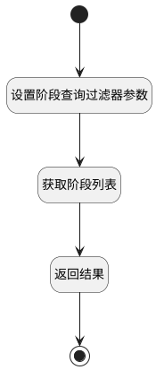

## 获取修改阶段 <!-- {docsify-ignore-all} -->

   获取修改阶段

### 处理过程




### 处理步骤说明

#### 开始 :id=Begin<sup class="footnote-symbol"> <font color=gray size=1>[开始]</font></sup>


*- N/A*
#### 设置阶段查询过滤器参数 :id=PREPAREPARAM1<sup class="footnote-symbol"> <font color=gray size=1>[准备参数]</font></sup>


1. 将`Default(传入变量).release` 设置给  `stage_filter(阶段查询过滤器).release`

#### 获取阶段列表 :id=DEDATASET1<sup class="footnote-symbol"> <font color=gray size=1>[实体数据集]</font></sup>


调用实体 [发布阶段(STAGE)](module/ProjMgmt/stage.md) 数据集合 [发布所属阶段(cur_stage)](module/ProjMgmt/stage#数据集合) ，查询参数为`stage_filter(阶段查询过滤器)`

将执行结果返回给参数`stages(阶段集合)`

#### 返回结果 :id=RAWSFCODE2<sup class="footnote-symbol"> <font color=gray size=1>[直接后台代码]</font></sup>


<p class="panel-title"><b>执行代码[Groovy]</b></p>

```groovy
def _default = logic.param('Default').getReal()
def first_stage = logic.param('first_stage').getReal()
def last_stage = logic.param('last_stage').getReal()
def current_stage = logic.param('current_stage').getReal()
def target_stage = logic.param('target_stage').getReal()
def stages = logic.param('stages').getReal()
def stage_transitions = logic.param('stage_transitions').getReal()

def current = _default.get('current_stage')
def target = _default.get('target_stage')
first_stage = stages.min { it.get('p_sequence') }
last_stage = stages.max { it.get('p_sequence') }
stages.each { it ->
    if(it.get('id') == current){
        it.set('current', 1)
        current_stage = it
    }
    if(it.get('id') == target){
        it.set('target', 1)
        target_stage = it
    }
}

// 向后变动阶段
if(target_stage.get('p_sequence') > current_stage.get('p_sequence')){
    target_stage.set('date_gt', current_stage.get('operated_time'))
    // 若当前阶段未存在操作时间，目标阶段时间需大于首阶段时间
    if(current_stage.get('operated_time') == null){
        target_stage.set('date_gt', first_stage.get('operated_time'))
    }
    if(target_stage.get('id') != last_stage.get('id')){
        target_stage.set('date_lt', last_stage.get('operated_time'))
    }
}
// 向前变动阶段
if(target_stage.get('p_sequence') < current_stage.get('p_sequence')){
    target_stage.set('date_lt', last_stage.get('operated_time'))
    if(target_stage.get('id') != first_stage.get('id')){
        target_stage.set('date_gt', first_stage.get('operated_time'))
    }
}
stage_transitions.add(current_stage)
stage_transitions.add(target_stage)
_default.set('stage_transitions', stage_transitions)

```

#### 结束 :id=END1<sup class="footnote-symbol"> <font color=gray size=1>[结束]</font></sup>


返回 `Default(传入变量)`


### 实体逻辑参数

|    中文名   |    代码名    |  数据类型    |  实体   |备注 |
| --------| --------| -------- | -------- | --------   |
|传入变量(<i class="fa fa-check"/></i>)|Default|数据对象|[项目发布(RELEASE)](module/ProjMgmt/release.md)||
|当前阶段对象|current_stage|数据对象|[发布阶段(STAGE)](module/ProjMgmt/stage.md)||
|首阶段对象|first_stage|数据对象|[发布阶段(STAGE)](module/ProjMgmt/stage.md)||
|末阶段对象|last_stage|数据对象|[发布阶段(STAGE)](module/ProjMgmt/stage.md)||
|阶段查询过滤器|stage_filter|过滤器|||
|发布阶段列表对象|stage_transitions|数据对象列表|[发布阶段(STAGE)](module/ProjMgmt/stage.md)||
|阶段集合|stages|分页查询|||
|目标阶段对象|target_stage|数据对象|[发布阶段(STAGE)](module/ProjMgmt/stage.md)||
