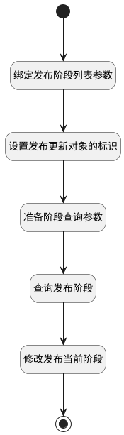

## 修改发布当前阶段 <!-- {docsify-ignore-all} -->

   修改发布当前阶段

### 处理过程




### 处理步骤说明

#### 开始 :id=Begin<sup class="footnote-symbol"> <font color=gray size=1>[开始]</font></sup>


*- N/A*
#### 绑定发布阶段列表参数 :id=BINDPARAM1<sup class="footnote-symbol"> <font color=gray size=1>[绑定参数]</font></sup>


绑定参数`Default(传入变量)` 到 `stage_transitions(发布阶段列表)`
#### 设置发布更新对象的标识 :id=PREPAREPARAM1<sup class="footnote-symbol"> <font color=gray size=1>[准备参数]</font></sup>


1. 将`Default(传入变量).release` 设置给  `update_obj(发布更新对象).ID(标识)`

#### 准备阶段查询参数 :id=PREPAREPARAM2<sup class="footnote-symbol"> <font color=gray size=1>[准备参数]</font></sup>


1. 将`Default(传入变量).release` 设置给  `stage_filter(阶段查询过滤器).release`

#### 查询发布阶段 :id=DEDATASET1<sup class="footnote-symbol"> <font color=gray size=1>[实体数据集]</font></sup>


调用实体 [发布阶段(STAGE)](module/ProjMgmt/stage.md) 数据集合 [发布所属阶段(cur_stage)](module/ProjMgmt/stage#数据集合) ，查询参数为`stage_filter(阶段查询过滤器)`

将执行结果返回给参数`stages(阶段集合)`

#### 修改发布当前阶段 :id=RAWSFCODE2<sup class="footnote-symbol"> <font color=gray size=1>[直接后台代码]</font></sup>


<p class="panel-title"><b>执行代码[Groovy]</b></p>

```groovy
def stage_transitions = logic.param('stage_transitions').getReal()
def stages = logic.param('stages').getReal()
def update_obj = logic.param('update_obj').getReal()

def first_stage = logic.param('first_stage').getReal()
def last_stage = logic.param('last_stage').getReal()
def current_stage = logic.param('current_stage').getReal()
def target_stage = logic.param('target_stage').getReal()

first_stage = stages.min { it.get('p_sequence') }
last_stage = stages.max { it.get('p_sequence') }
//首阶段标识
def first_stage_id = first_stage.get('id')
//末阶段标识
def last_stage_id = last_stage.get('id')
//获取实体运行对象
def stage_runtime = sys.dataentity('stage')
def release_runtime = sys.dataentity('release')
//循环处理
stage_transitions.each { it ->
    def stage_id = it.get('id')
    if(it.get('target') == 1){
        it.set('is_current', 1)
        target_stage = it
        if(first_stage_id != null){
            if(first_stage_id == stage_id){
                update_obj.set('start_at', it.get('operated_time'))
            }
        }
        if(last_stage_id != null){
            if(last_stage_id == stage_id){
                update_obj.set('end_at', it.get('operated_time'))
            }
        }
        update_obj.set('status', stage_id) 
    }
    if(it.get('current') == 1){
        it.set('is_current', 0)
        current_stage = it
    }
    //更新阶段
    stage_runtime.update(it)
}
// 向前变动阶段时, 从当前阶段 -> 目标阶段 的中间阶段将操作时间置空
if(target_stage.get('p_sequence') < current_stage.get('p_sequence')){
    stages.each { it ->
        if(it.get('p_sequence') > target_stage.get('p_sequence')){
            // 构造阶段更新对象
            def update_stage = stage_runtime.entity()
            update_stage.set('id', it.get('id'))
            if(current_stage.get('id') == last_stage_id){
                if(it.get('p_sequence') < current_stage.get('p_sequence')){
                    update_stage.set('operated_time', null)
                    stage_runtime.update(update_stage)
                }
            } else {
                if(it.get('p_sequence') <= current_stage.get('p_sequence')){
                    update_stage.set('operated_time', null)
                    stage_runtime.update(update_stage)
                }
            }
        }
    }
}
release_runtime.update(update_obj)

```

#### 结束 :id=END1<sup class="footnote-symbol"> <font color=gray size=1>[结束]</font></sup>


返回 `update_obj(发布更新对象)`


### 实体逻辑参数

|    中文名   |    代码名    |  数据类型    |  实体   |备注 |
| --------| --------| -------- | -------- | --------   |
|传入变量(<i class="fa fa-check"/></i>)|Default|数据对象|[项目发布(RELEASE)](module/ProjMgmt/release.md)||
|当前阶段对象|current_stage|数据对象|[发布阶段(STAGE)](module/ProjMgmt/stage.md)||
|首阶段对象|first_stage|数据对象|[发布阶段(STAGE)](module/ProjMgmt/stage.md)||
|末阶段对象|last_stage|数据对象|[发布阶段(STAGE)](module/ProjMgmt/stage.md)||
|阶段查询过滤器|stage_filter|过滤器|||
|发布阶段列表|stage_transitions|数据对象列表|[发布阶段(STAGE)](module/ProjMgmt/stage.md)||
|阶段集合|stages|分页查询|||
|目标阶段对象|target_stage|数据对象|[发布阶段(STAGE)](module/ProjMgmt/stage.md)||
|发布更新对象|update_obj|数据对象|[项目发布(RELEASE)](module/ProjMgmt/release.md)||
