## 项目下发布（移动端） <!-- {docsify-ignore-all} -->

   

### 处理过程

```plantuml
@startuml
hide empty description
<style>
root {
  HyperlinkColor #42b983
}
</style>

hide empty description
state "开始" as Begin <<start>> [[$./mob_project_release#begin {"开始"}]]
state "设置过滤器" as PREPAREPARAM1  [[$./mob_project_release#prepareparam1 {"设置过滤器"}]]
state "项目下发布" as DEDATASET1  [[$./mob_project_release#dedataset1 {"项目下发布"}]]
state "设置进度" as RAWSFCODE1  [[$./mob_project_release#rawsfcode1 {"设置进度"}]]
state "结束" as END1 <<end>> [[$./mob_project_release#end1 {"结束"}]]


Begin --> PREPAREPARAM1
PREPAREPARAM1 --> DEDATASET1
DEDATASET1 --> RAWSFCODE1
RAWSFCODE1 --> END1


@enduml
```




### 处理步骤说明

#### 开始 :id=Begin<sup class="footnote-symbol"> <font color=gray size=1>[开始]</font></sup>


*- N/A*
#### 设置过滤器 :id=PREPAREPARAM1<sup class="footnote-symbol"> <font color=gray size=1>[准备参数]</font></sup>


1. 将`Default(传入变量).project` 设置给  `filter(过滤器).N_PROJECT_ID_EQ`

#### 项目下发布 :id=DEDATASET1<sup class="footnote-symbol"> <font color=gray size=1>[实体数据集]</font></sup>


调用实体 [项目发布(RELEASE)](module/ProjMgmt/release.md) 数据集合 [数据集(DEFAULT)](module/ProjMgmt/release#数据集合) ，查询参数为`filter(过滤器)`

将执行结果返回给参数`release_page_result(发布分页结果)`

#### 设置进度 :id=RAWSFCODE1<sup class="footnote-symbol"> <font color=gray size=1>[直接后台代码]</font></sup>


<p class="panel-title"><b>执行代码[Groovy]</b></p>

```groovy
def release_page_result = logic.param('release_page_result').getReal()
release_page_result.each { release ->
    def all_work_items = release.get('all_work_items')
    def completed_work_items = release.get('completed_work_items')
    def schedule = 0
    if (all_work_items != 0 && completed_work_items != 0) {
        schedule = Math.round(completed_work_items / all_work_items * 100)
    }
    release.set('schedule', schedule)
    release.set('schedule_text', schedule + "%")
}

```

#### 结束 :id=END1<sup class="footnote-symbol"> <font color=gray size=1>[结束]</font></sup>


返回 `release_page_result(发布分页结果)`


### 实体逻辑参数

|    中文名   |    代码名    |  数据类型    |  实体   |备注 |
| --------| --------| -------- | -------- | --------   |
|传入变量(<i class="fa fa-check"/></i>)|Default|过滤器|||
|过滤器|filter|过滤器|||
|发布分页结果|release_page_result|分页查询|||
