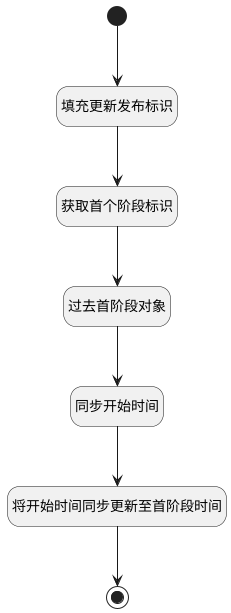

## 开始时间变更附加逻辑 <!-- {docsify-ignore-all} -->

   更新首个发布阶段的时间

### 处理过程




### 处理步骤说明

#### 开始 :id=Begin<sup class="footnote-symbol"> <font color=gray size=1>[开始]</font></sup>


*- N/A*
#### 填充更新发布标识 :id=PREPAREPARAM1<sup class="footnote-symbol"> <font color=gray size=1>[准备参数]</font></sup>


1. 将`Default(传入变量).ID(标识)` 设置给  `update_obj(更新发布对象).ID(标识)`

#### 获取首个阶段标识 :id=RAWSQLCALL1<sup class="footnote-symbol"> <font color=gray size=1>[直接SQL调用]</font></sup>


<p class="panel-title"><b>执行sql语句</b></p>

```sql
select  t1.`id`
from `stage` t1, `stage` t2 
where  t1.`RELEASE_ID` = ?
and t1.`pid` = t2.`id` 
order by t2.`SEQUENCE` asc limit 1
```

<p class="panel-title"><b>执行sql参数</b></p>

1. `Default(传入变量).ID(标识)`

将执行sql结果赋值给参数`first_stage(首发布阶段)`

#### 过去首阶段对象 :id=DEACTION1<sup class="footnote-symbol"> <font color=gray size=1>[实体行为]</font></sup>


调用实体 [发布阶段(STAGE)](module/ProjMgmt/stage.md) 行为 [Get](module/ProjMgmt/stage#行为) ，行为参数为`first_stage(首发布阶段)`

#### 同步开始时间 :id=PREPAREPARAM2<sup class="footnote-symbol"> <font color=gray size=1>[准备参数]</font></sup>


1. 将`Default(传入变量).START_AT(开始时间)` 设置给  `first_stage(首发布阶段).OPERATED_TIME(操作时间)`

#### 将开始时间同步更新至首阶段时间 :id=DEACTION2<sup class="footnote-symbol"> <font color=gray size=1>[实体行为]</font></sup>


调用实体 [发布阶段(STAGE)](module/ProjMgmt/stage.md) 行为 [Update](module/ProjMgmt/stage#行为) ，行为参数为`first_stage(首发布阶段)`

#### 结束 :id=END1<sup class="footnote-symbol"> <font color=gray size=1>[结束]</font></sup>


*- N/A*


### 连接条件说明
#### 开始时间和首阶段时间不一致 


### 实体逻辑参数

|    中文名   |    代码名    |  数据类型    |  实体   |备注 |
| --------| --------| -------- | -------- | --------   |
|传入变量(<i class="fa fa-check"/></i>)|Default|数据对象|[项目发布(RELEASE)](module/ProjMgmt/release.md)||
|首发布阶段|first_stage|数据对象|[发布阶段(STAGE)](module/ProjMgmt/stage.md)||
|更新发布对象|update_obj|数据对象|[项目发布(RELEASE)](module/ProjMgmt/release.md)||
